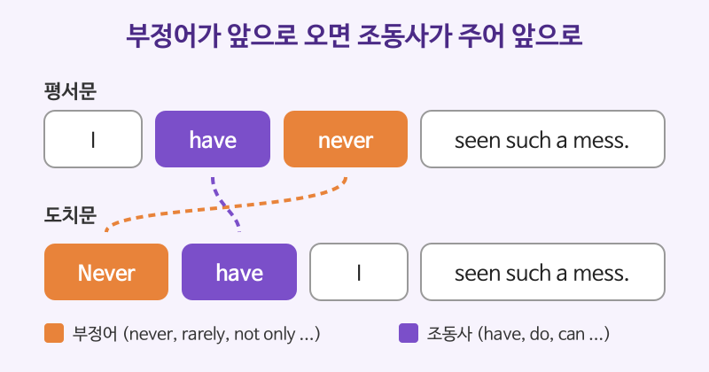

# 부정어 도치 (Never have I ...)

## 이번 강의에서 배울 것

- 부정어나 제한어가 문장 앞에 올 때 주어와 조동사의 순서가 바뀌는 규칙
- Not only, No sooner, Hardly, Only then 같은 표현의 도치
- 도치가 어울리는 상황(격식체, 연설, 글)과 어울리지 않는 상황

## 핵심 설명

never, rarely, not only처럼 **부정·제한의 의미를 가진 말을 문장 맨 앞으로 보내 강조하면**, 뒤따르는 부분이 **의문문 어순(조동사 + 주어)** 으로 바뀝니다.

| 평서문 | 도치문 |
|---|---|
| I have **never** seen such a mess. | **Never have I** seen such a mess. |
| He **rarely** speaks in meetings. | **Rarely does he** speak in meetings. |

- 조동사(have, will, can 등)가 있으면 그 조동사를 주어 앞으로 보냅니다.
- 조동사가 없으면 **do / does / did** 를 만들어 주어 앞에 둡니다.
- be동사는 그대로 주어 앞으로 보냅니다. (Rarely **is she** late.)

### 자주 쓰는 도치 표현

| 영어 | 한국어 | 듣기 |
|---|---|---|
| Never have I seen such a beautiful sunset. | 이렇게 아름다운 노을은 처음 본다. | [🔊](audio/01-inversion-01.mp3) |
| Not only did she pass the exam, but she also topped the class. | 그녀는 시험에 합격했을 뿐 아니라 반에서 1등까지 했다. | [🔊](audio/01-inversion-02.mp3) |
| No sooner had we arrived than it started to rain. | 우리가 도착하자마자 비가 오기 시작했다. | [🔊](audio/01-inversion-03.mp3) |
| Hardly had the meeting begun when the power went out. | 회의가 시작되자마자 정전이 되었다. | [🔊](audio/01-inversion-04.mp3) |
| Only then did I realize my mistake. | 그제야 나는 내 실수를 깨달았다. | [🔊](audio/01-inversion-05.mp3) |
| Under no circumstances should you share your password. | 어떤 경우에도 비밀번호를 공유해서는 안 됩니다. | [🔊](audio/01-inversion-06.mp3) |

### 영국식 발음으로 들어 보기

같은 문장을 영국식 억양으로 들어 보세요. 강세와 모음 소리가 어떻게 다른지 비교해 보면 좋습니다.

| 영어 | 한국어 | 듣기 |
|---|---|---|
| Seldom do we see such commitment. | 그런 헌신은 좀처럼 보기 힘들다. | [🔊](audio/01-inversion-07-uk.mp3) |
| Little did he know what was coming. | 그는 앞으로 무슨 일이 닥칠지 전혀 몰랐다. | [🔊](audio/01-inversion-08-uk.mp3) |

> 💡 도치는 **격식 있는 글, 연설, 프레젠테이션**에서 강조 효과를 냅니다. 친구와의 대화에서 쓰면 과장되거나 연극처럼 들릴 수 있습니다. 대화에서는 "I've never seen anything like it."이 더 자연스럽습니다.

## 자주 하는 실수

- ❌ Never I have seen it. → ✅ Never have I seen it.
  - 부정어가 앞에 오면 조동사가 반드시 주어 앞으로 옵니다.
- ❌ Rarely he goes out. → ✅ Rarely does he go out.
  - 조동사가 없으면 does를 만들고, 동사는 원형(go)으로 돌아갑니다.
- ❌ Not only she is smart, but ... → ✅ Not only is she smart, but ...
  - be동사도 주어 앞으로 이동합니다.
- ❌ Only after he left I noticed. → ✅ Only after he left did I notice.
  - "Only + 부사절"에서는 **주절**이 도치됩니다. 부사절(he left)은 그대로 둡니다.

## 연습 문제

주어진 표현으로 시작하도록 문장을 바꾸세요.

1. I have never felt so proud. (Never)
2. She seldom complains. (Seldom)
3. He not only lost the match but also hurt his knee. (Not only)
4. You must not open this door under any circumstances. (Under no circumstances)
5. I understood the problem only when I read the report. (Only when)

## 정답과 해설

1. **Never have I felt so proud.**: 조동사 have를 주어 앞으로.
2. **Seldom does she complain.**: 조동사가 없으므로 does를 쓰고 complain은 원형.
3. **Not only did he lose the match, but he also hurt his knee.**: 과거이므로 did, lose는 원형.
4. **Under no circumstances must you open this door.**: 조동사 must를 주어 앞으로.
5. **Only when I read the report did I understand the problem.**: when절은 그대로, 주절을 도치.

## 오늘의 단어

| 단어 | 뜻 | 예문 | 듣기 |
|---|---|---|---|
| seldom | 좀처럼 ~않는 | Seldom do we meet in person. | [🔊](audio/01-inversion-w01.mp3) |
| circumstance | 상황, 사정 | Under no circumstances should you leave. | [🔊](audio/01-inversion-w02.mp3) |
| commitment | 헌신, 약속 | Her commitment impressed everyone. | [🔊](audio/01-inversion-w03.mp3) |
| realize | 깨닫다 | Only then did I realize it. | [🔊](audio/01-inversion-w04.mp3) |
| top | (시험·순위에서) 1등을 하다 | She topped the class. | [🔊](audio/01-inversion-w05.mp3) |
