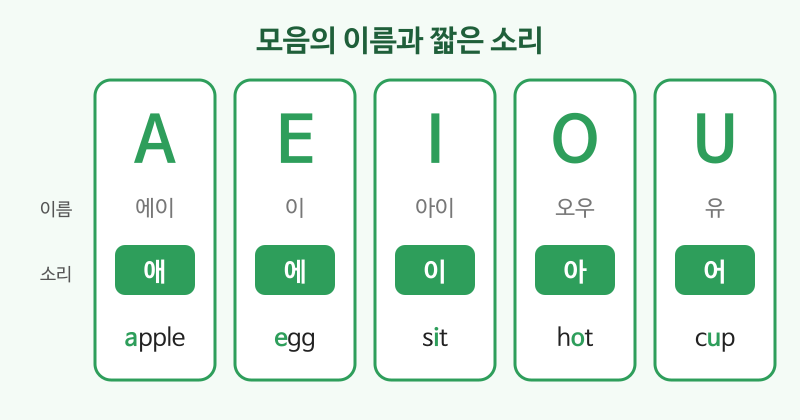

# 알파벳과 발음 기초

## 이번 강의에서 배울 것

- 알파벳에는 **이름**과 단어 속에서 나는 **소리**가 따로 있다는 것
- 모음 a, e, i, o, u의 짧은 소리
- 한국어에 없어서 헷갈리기 쉬운 자음 소리 (f/p, v/b, r/l, th)

## 핵심 설명

영어 알파벳은 26자이고, 그중 **a, e, i, o, u** 다섯 개가 모음입니다. 알파벳을 부를 때의 이름("에이, 비, 씨")과 단어 안에서 실제로 나는 소리는 다릅니다. 단어를 읽을 때는 **소리**가 중요합니다.

### 1) 모음의 짧은 소리

짧은 단어 속 모음은 대부분 짧은 소리로 읽습니다.

| 영어 | 한국어 | 듣기 |
|---|---|---|
| A, as in apple. | a는 apple(사과)의 "애" 소리 | [🔊](audio/01-alphabet-01.mp3) [🐢](audio/01-alphabet-01-slow.mp3) |
| E, as in egg. | e는 egg(달걀)의 "에" 소리 | [🔊](audio/01-alphabet-02.mp3) [🐢](audio/01-alphabet-02-slow.mp3) |
| I, as in sit. | i는 sit(앉다)의 짧은 "이" 소리 | [🔊](audio/01-alphabet-03.mp3) [🐢](audio/01-alphabet-03-slow.mp3) |
| O, as in hot. | o는 hot(뜨거운)의 "아" 소리 | [🔊](audio/01-alphabet-04.mp3) [🐢](audio/01-alphabet-04-slow.mp3) |
| U, as in cup. | u는 cup(컵)의 짧은 "어" 소리 | [🔊](audio/01-alphabet-05.mp3) [🐢](audio/01-alphabet-05-slow.mp3) |

> 💡 단어 끝에 소리 나지 않는 e가 붙으면 앞의 모음이 **이름대로** 읽힙니다. cap(캡) → cape(케이프), hop(합) → hope(호웁).

### 2) 한국인이 헷갈리기 쉬운 자음

두 단어를 번갈아 들으며 차이를 느껴 보세요.

| 영어 | 한국어 | 듣기 |
|---|---|---|
| fan, pan | 선풍기, 프라이팬 (f는 윗니로 아랫입술을 살짝 물고) | [🔊](audio/01-alphabet-06.mp3) [🐢](audio/01-alphabet-06-slow.mp3) |
| very, berry | 매우, 산딸기 (v는 f처럼 물고 목을 울려서) | [🔊](audio/01-alphabet-07.mp3) [🐢](audio/01-alphabet-07-slow.mp3) |
| right, light | 오른쪽, 빛 (r은 혀를 말고, l은 혀끝을 윗니 뒤에) | [🔊](audio/01-alphabet-08.mp3) [🐢](audio/01-alphabet-08-slow.mp3) |
| think, sink | 생각하다, 싱크대 (th는 혀끝을 이 사이에) | [🔊](audio/01-alphabet-09.mp3) [🐢](audio/01-alphabet-09-slow.mp3) |

### 3) 이름 철자 말하기

예약하거나 전화할 때 이름 철자를 말할 일이 많습니다. 알파벳 **이름**을 또박또박 말하면 됩니다.

| 영어 | 한국어 | 듣기 |
|---|---|---|
| My name is Kim. K, I, M. | 제 이름은 김입니다. K, I, M. | [🔊](audio/01-alphabet-10.mp3) [🐢](audio/01-alphabet-10-slow.mp3) |
| How do you spell that? | 철자가 어떻게 되나요? | [🔊](audio/01-alphabet-11.mp3) [🐢](audio/01-alphabet-11-slow.mp3) |

## 자주 하는 실수

- ❌ coffee를 "커피"의 ㅍ으로 발음 → ✅ f는 윗니로 아랫입술을 물고 바람을 내보냅니다.
  - ㅍ으로 발음하면 원어민에게 copy처럼 들릴 수 있습니다.
- ❌ rice와 lice를 같은 소리로 발음 → ✅ r은 혀끝이 입천장에 닿지 않고, l은 닿습니다.
  - rice는 쌀, lice는 이(벌레)입니다. 식당에서는 차이가 큽니다.
- ❌ 모든 단어 끝에 "으"를 붙이기 (bus를 "버스으") → ✅ 끝 자음은 짧게 끊습니다.

## 연습 문제

밑줄 친 모음이 짧은 소리인지, 이름대로 읽는 긴 소리인지 고르세요.

1. c**a**t
2. c**a**ke
3. b**i**g
4. b**i**ke
5. n**o**te

## 정답과 해설

1. **짧은 소리 (애)**: 끝에 e가 없습니다.
2. **긴 소리 (에이)**: 끝에 소리 나지 않는 e가 있습니다.
3. **짧은 소리 (이)**
4. **긴 소리 (아이)**: 끝의 e 때문에 i를 이름대로 읽습니다.
5. **긴 소리 (오우)**: 끝의 e 때문에 o를 이름대로 읽습니다.

## 오늘의 단어

| 단어 | 뜻 | 예문 | 듣기 |
|---|---|---|---|
| vowel | 모음 | A, E, I, O and U are vowels. | [🔊](audio/01-alphabet-w01.mp3) |
| spell | 철자를 말하다 | Can you spell your name? | [🔊](audio/01-alphabet-w02.mp3) |
| sound | 소리 | This letter has two sounds. | [🔊](audio/01-alphabet-w03.mp3) |
| letter | 글자, 문자 | There are 26 letters. | [🔊](audio/01-alphabet-w04.mp3) |
| repeat | 따라 하다 | Listen and repeat. | [🔊](audio/01-alphabet-w05.mp3) |
