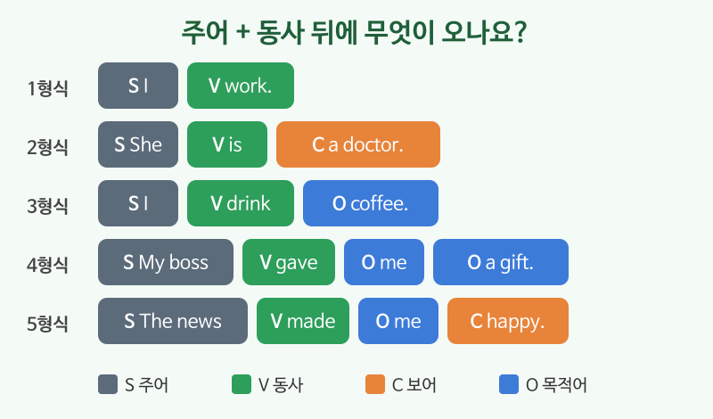

# 문장의 5형식 맛보기

## 이번 강의에서 배울 것

- 영어 문장은 **주어 + 동사**로 시작한다는 것
- 동사 뒤에 무엇이 오느냐에 따라 문장이 다섯 가지 모양으로 나뉜다는 것
- 우리말과 영어의 어순 차이 ("나는 커피를 마신다" vs "I drink coffee")

## 핵심 설명

우리말은 동사가 맨 끝에 오지만, 영어는 **주어 바로 다음에 동사**가 옵니다. 그리고 동사 뒤에 어떤 말이 붙는지에 따라 문장 모양이 정해집니다. 이것을 흔히 "5형식"이라고 부릅니다. 이름을 외울 필요는 없고, **모양**만 눈에 익히면 됩니다.

| 기호 | 뜻 | 예 |
|---|---|---|
| S | 주어 (누가) | I, She, My boss |
| V | 동사 (한다, 이다) | work, is, gave |
| C | 보어 (주어나 목적어가 어떤지) | tired, a doctor |
| O | 목적어 (무엇을, 누구에게) | coffee, me |

### 다섯 가지 모양

| 영어 | 한국어 | 듣기 |
|---|---|---|
| I work. | (1형식 S+V) 나는 일한다. | [🔊](audio/02-sentence-forms-01.mp3) [🐢](audio/02-sentence-forms-01-slow.mp3) |
| She is a doctor. | (2형식 S+V+C) 그녀는 의사이다. | [🔊](audio/02-sentence-forms-02.mp3) [🐢](audio/02-sentence-forms-02-slow.mp3) |
| I drink coffee. | (3형식 S+V+O) 나는 커피를 마신다. | [🔊](audio/02-sentence-forms-03.mp3) [🐢](audio/02-sentence-forms-03-slow.mp3) |
| My boss gave me a gift. | (4형식 S+V+O+O) 상사가 나에게 선물을 주었다. | [🔊](audio/02-sentence-forms-04.mp3) [🐢](audio/02-sentence-forms-04-slow.mp3) |
| The news made me happy. | (5형식 S+V+O+C) 그 소식이 나를 기쁘게 했다. | [🔊](audio/02-sentence-forms-05.mp3) [🐢](audio/02-sentence-forms-05-slow.mp3) |

### 문장 늘리기

기본 모양 뒤에 장소나 시간을 덧붙이면 문장이 길어집니다. 이런 말은 보통 **문장 끝**에 옵니다.

| 영어 | 한국어 | 듣기 |
|---|---|---|
| I work at a bank. | 나는 은행에서 일한다. | [🔊](audio/02-sentence-forms-06.mp3) [🐢](audio/02-sentence-forms-06-slow.mp3) |
| I drink coffee every morning. | 나는 매일 아침 커피를 마신다. | [🔊](audio/02-sentence-forms-07.mp3) [🐢](audio/02-sentence-forms-07-slow.mp3) |

> 💡 영어는 "누가 → 한다 → 무엇을 → 어디서 → 언제" 순서로 생각하면 쉽습니다.

## 자주 하는 실수

- ❌ I coffee drink. → ✅ I drink coffee.
  - 우리말 순서대로 동사를 뒤에 두면 안 됩니다. 동사는 주어 바로 뒤에 옵니다.
- ❌ Is raining. → ✅ It is raining.
  - 영어 문장에는 주어가 꼭 있어야 합니다. 날씨나 시간은 It을 주어로 씁니다.
- ❌ She gave a gift me. → ✅ She gave me a gift.
  - "누구에게"가 먼저, "무엇을"이 나중입니다.

## 연습 문제

단어를 바른 순서로 배열하세요.

1. (English / I / study)
2. (is / kind / He)
3. (lunch / We / at noon / eat)
4. (me / my friend / sent / a message)
5. (the room / keep / clean / Please)

## 정답과 해설

1. **I study English.**: 주어 + 동사 + 목적어 (3형식).
2. **He is kind.**: 주어 + 동사 + 보어 (2형식).
3. **We eat lunch at noon.**: 시간 표현은 문장 끝.
4. **My friend sent me a message.**: 누구에게(me)가 무엇을(a message)보다 먼저 (4형식).
5. **Please keep the room clean.**: 목적어(the room) 뒤에 상태(clean) (5형식). 명령문은 주어 You를 생략합니다.

## 오늘의 단어

| 단어 | 뜻 | 예문 | 듣기 |
|---|---|---|---|
| sentence | 문장 | This is a short sentence. | [🔊](audio/02-sentence-forms-w01.mp3) |
| gift | 선물 | Thank you for the gift. | [🔊](audio/02-sentence-forms-w02.mp3) |
| bank | 은행 | The bank opens at nine. | [🔊](audio/02-sentence-forms-w03.mp3) |
| send | 보내다 | Please send me the file. | [🔊](audio/02-sentence-forms-w04.mp3) |
| keep | 유지하다, 계속 두다 | Keep the door open. | [🔊](audio/02-sentence-forms-w05.mp3) |
