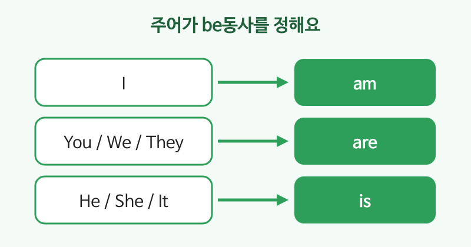

# be동사 (am, are, is)

## 이번 강의에서 배울 것

- be동사가 "~이다", "~에 있다"라는 뜻으로 쓰인다는 것
- 주어에 따라 am, are, is 중 무엇을 쓰는지
- 줄임말(I'm, you're, he's)로 자연스럽게 말하기

## 핵심 설명

be동사는 주어가 **누구인지, 어떤 상태인지, 어디에 있는지** 말할 때 씁니다. 우리말의 "~이다", "~하다(상태)", "~에 있다"에 해당합니다.

어떤 be동사를 쓸지는 **주어**가 정합니다.

| 주어 | be동사 | 줄임말 |
|---|---|---|
| I | am | I'm |
| You / We / They | are | You're / We're / They're |
| He / She / It | is | He's / She's / It's |

### 1) ~이다 (신분, 직업)

| 영어 | 한국어 | 듣기 |
|---|---|---|
| I am an office worker. | 나는 회사원이다. | [🔊](audio/03-be-verb-01.mp3) [🐢](audio/03-be-verb-01-slow.mp3) |
| She is my manager. | 그녀는 내 상사이다. | [🔊](audio/03-be-verb-02.mp3) [🐢](audio/03-be-verb-02-slow.mp3) |
| We are colleagues. | 우리는 동료이다. | [🔊](audio/03-be-verb-03.mp3) [🐢](audio/03-be-verb-03-slow.mp3) |

### 2) ~하다 (상태, 기분)

| 영어 | 한국어 | 듣기 |
|---|---|---|
| I'm tired today. | 나는 오늘 피곤하다. | [🔊](audio/03-be-verb-04.mp3) [🐢](audio/03-be-verb-04-slow.mp3) |
| The coffee is hot. | 커피가 뜨겁다. | [🔊](audio/03-be-verb-05.mp3) [🐢](audio/03-be-verb-05-slow.mp3) |

### 3) ~에 있다 (장소)

| 영어 | 한국어 | 듣기 |
|---|---|---|
| He is at the office. | 그는 사무실에 있다. | [🔊](audio/03-be-verb-06.mp3) [🐢](audio/03-be-verb-06-slow.mp3) |
| They're in Busan now. | 그들은 지금 부산에 있다. | [🔊](audio/03-be-verb-07.mp3) [🐢](audio/03-be-verb-07-slow.mp3) |

> 💡 일상 대화에서는 거의 항상 줄임말을 씁니다. "I am tired."보다 "I'm tired."가 훨씬 자연스럽습니다.

## 자주 하는 실수

- ❌ I am go to work. → ✅ I go to work.
  - be동사와 일반동사(go)를 함께 쓰지 않습니다.
- ❌ He are busy. → ✅ He is busy.
  - He, She, It 뒤에는 is를 씁니다.
- ❌ I happy. → ✅ I'm happy.
  - 우리말 "나 행복해"에는 동사가 안 보이지만, 영어에서는 be동사가 꼭 필요합니다.

## 연습 문제

빈칸에 am, are, is 중 알맞은 것을 넣으세요.

1. My sister ___ a nurse.
2. You ___ late again.
3. I ___ from Seoul.
4. The meeting rooms ___ on the third floor.
5. It ___ cold outside.

## 정답과 해설

1. **is**: My sister는 She로 바꿀 수 있으므로 is.
2. **are**: You 뒤에는 are.
3. **am**: I 뒤에는 am.
4. **are**: rooms가 복수(They)이므로 are.
5. **is**: It 뒤에는 is. 날씨를 말할 때 It is를 자주 씁니다.

## 오늘의 단어

| 단어 | 뜻 | 예문 | 듣기 |
|---|---|---|---|
| office worker | 회사원 | I'm an office worker. | [🔊](audio/03-be-verb-w01.mp3) |
| colleague | 동료 | She is my colleague. | [🔊](audio/03-be-verb-w02.mp3) |
| tired | 피곤한 | We're tired. | [🔊](audio/03-be-verb-w03.mp3) |
| busy | 바쁜 | He is busy now. | [🔊](audio/03-be-verb-w04.mp3) |
| late | 늦은 | Sorry, I'm late. | [🔊](audio/03-be-verb-w05.mp3) |
