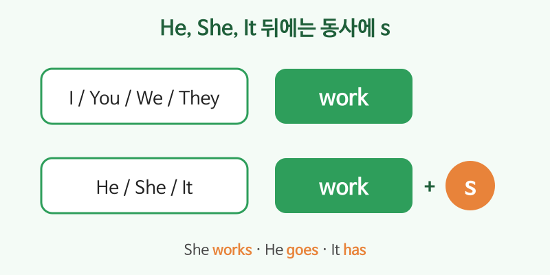

# 일반동사 현재형 (I work, She works)

## 이번 강의에서 배울 것

- 습관, 반복되는 일, 변하지 않는 사실을 말할 때 현재형을 쓴다는 것
- 주어가 He, She, It일 때 동사에 **-s**를 붙이는 규칙
- don't / doesn't로 부정문, Do / Does로 의문문 만들기

## 핵심 설명

be동사(am, are, is)가 아닌 나머지 동사를 **일반동사**라고 합니다. work, live, like, go처럼 동작이나 상태를 나타냅니다. 현재형은 "지금 이 순간"보다 **평소에, 늘** 하는 일을 말할 때 씁니다.

| 주어 | 긍정 | 부정 | 의문 |
|---|---|---|---|
| I / You / We / They | I **work**. | I **don't** work. | **Do** you work? |
| He / She / It | She **works**. | She **doesn't** work. | **Does** she work? |

### -s 붙이는 법

| 규칙 | 예 |
|---|---|
| 대부분: + s | work → works, like → likes |
| s, sh, ch, x, o로 끝나면: + es | watch → watches, go → goes |
| 자음 + y로 끝나면: y를 i로 바꾸고 + es | study → studies |
| 불규칙 | have → has |

### 습관과 반복

| 영어 | 한국어 | 듣기 |
|---|---|---|
| I get up at seven. | 나는 7시에 일어난다. | [🔊](audio/04-present-simple-01.mp3) [🐢](audio/04-present-simple-01-slow.mp3) |
| She works from home on Fridays. | 그녀는 금요일마다 재택근무를 한다. | [🔊](audio/04-present-simple-02.mp3) [🐢](audio/04-present-simple-02-slow.mp3) |
| My husband cooks dinner. | 남편이 저녁을 요리한다. | [🔊](audio/04-present-simple-03.mp3) [🐢](audio/04-present-simple-03-slow.mp3) |

### 부정문과 의문문

| 영어 | 한국어 | 듣기 |
|---|---|---|
| I don't drink coffee at night. | 나는 밤에는 커피를 마시지 않는다. | [🔊](audio/04-present-simple-04.mp3) [🐢](audio/04-present-simple-04-slow.mp3) |
| He doesn't have a car. | 그는 차가 없다. | [🔊](audio/04-present-simple-05.mp3) [🐢](audio/04-present-simple-05-slow.mp3) |
| Do you live near here? | 이 근처에 사세요? | [🔊](audio/04-present-simple-06.mp3) [🐢](audio/04-present-simple-06-slow.mp3) |
| Does the store open on Sundays? | 그 가게는 일요일에 문을 여나요? | [🔊](audio/04-present-simple-07.mp3) [🐢](audio/04-present-simple-07-slow.mp3) |

> 💡 doesn't와 Does 뒤에서는 -s가 사라집니다. She doesn't **work**. Does she **work**? (works ❌)

## 자주 하는 실수

- ❌ She work in Seoul. → ✅ She works in Seoul.
  - He, She, It 뒤의 -s를 빠뜨리는 실수가 가장 흔합니다.
- ❌ He doesn't likes it. → ✅ He doesn't like it.
  - doesn't가 이미 -s 역할을 하므로 동사는 원형으로 씁니다.
- ❌ Are you like movies? → ✅ Do you like movies?
  - 일반동사의 의문문은 be동사가 아니라 Do / Does로 만듭니다.

## 연습 문제

괄호 안의 동사를 알맞게 바꾸세요.

1. My son ___ (play) soccer after school.
2. We ___ (not, eat) meat.
3. ___ your sister ___ (speak) English?
4. The bus ___ (go) to the airport.
5. She ___ (study) Chinese on weekends.

## 정답과 해설

1. **plays**: My son은 He이므로 + s.
2. **don't eat**: We의 부정은 don't + 원형.
3. **Does / speak**: your sister는 She이므로 Does, 동사는 원형.
4. **goes**: o로 끝나는 동사는 + es.
5. **studies**: 자음 + y는 y를 i로 바꾸고 + es.

## 오늘의 단어

| 단어 | 뜻 | 예문 | 듣기 |
|---|---|---|---|
| get up | 일어나다 | I get up early. | [🔊](audio/04-present-simple-w01.mp3) |
| work from home | 재택근무하다 | I work from home today. | [🔊](audio/04-present-simple-w02.mp3) |
| cook | 요리하다 | He cooks very well. | [🔊](audio/04-present-simple-w03.mp3) |
| near | 가까이에 | The station is near here. | [🔊](audio/04-present-simple-w04.mp3) |
| weekend | 주말 | What do you do on weekends? | [🔊](audio/04-present-simple-w05.mp3) |
