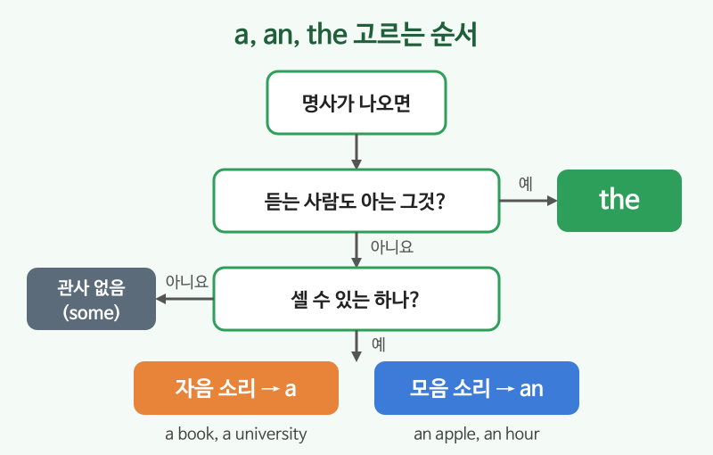

# 명사와 관사 (a, an, the)

## 이번 강의에서 배울 것

- 셀 수 있는 명사와 셀 수 없는 명사의 차이
- 복수형 만드는 법 (-s, -es, 불규칙)
- a, an, the를 고르는 기준

## 핵심 설명

명사는 사람, 물건, 장소, 개념의 이름입니다. 영어에서는 명사를 쓸 때마다 **"하나인가, 여럿인가, 셀 수 있는가"** 를 따지고, 그에 맞게 앞에 **관사**(a, an, the)를 붙입니다. 우리말에는 없는 규칙이라 처음엔 낯설지만, 아래 그림의 순서대로 생각하면 쉽습니다.

### 1) a와 an: 처음 말하는 하나

뒤에 오는 단어의 **첫 소리**가 모음이면 an, 아니면 a를 씁니다. 철자가 아니라 소리가 기준입니다.

| 영어 | 한국어 | 듣기 |
|---|---|---|
| I have a meeting today. | 오늘 회의가 하나 있다. | [🔊](audio/01-nouns-articles-01.mp3) [🐢](audio/01-nouns-articles-01-slow.mp3) |
| She is an engineer. | 그녀는 엔지니어이다. | [🔊](audio/01-nouns-articles-02.mp3) [🐢](audio/01-nouns-articles-02-slow.mp3) |
| It takes an hour. | 한 시간 걸린다. (h가 소리 나지 않음) | [🔊](audio/01-nouns-articles-03.mp3) [🐢](audio/01-nouns-articles-03-slow.mp3) |
| He goes to a university in Seoul. | 그는 서울에 있는 대학에 다닌다. (u가 "유" 소리) | [🔊](audio/01-nouns-articles-04.mp3) [🐢](audio/01-nouns-articles-04-slow.mp3) |

### 2) the: 서로 알고 있는 그것

| 영어 | 한국어 | 듣기 |
|---|---|---|
| I bought a book. The book is about money. | 책을 한 권 샀다. 그 책은 돈에 관한 것이다. | [🔊](audio/01-nouns-articles-05.mp3) [🐢](audio/01-nouns-articles-05-slow.mp3) |
| Can you close the window? | 창문 좀 닫아 줄래요? (지금 보이는 그 창문) | [🔊](audio/01-nouns-articles-06.mp3) [🐢](audio/01-nouns-articles-06-slow.mp3) |

### 3) 복수형과 셀 수 없는 명사

| 규칙 | 예 |
|---|---|
| 대부분: + s | car → cars, friend → friends |
| s, sh, ch, x로 끝나면: + es | bus → buses, box → boxes |
| 자음 + y: y를 i로 + es | city → cities |
| 불규칙 | man → men, child → children, person → people |
| 셀 수 없는 명사 (복수형 없음, a/an 없음) | water, money, information, advice |

| 영어 | 한국어 | 듣기 |
|---|---|---|
| I have two children. | 나는 아이가 둘 있다. | [🔊](audio/01-nouns-articles-07.mp3) [🐢](audio/01-nouns-articles-07-slow.mp3) |
| Can I get some water? | 물 좀 주시겠어요? | [🔊](audio/01-nouns-articles-08.mp3) [🐢](audio/01-nouns-articles-08-slow.mp3) |

> 💡 셀 수 없는 명사는 a 대신 **some**(약간의)이나 **a glass of**(한 잔의) 같은 말로 양을 나타냅니다.

## 자주 하는 실수

- ❌ I am engineer. → ✅ I am an engineer.
  - 직업 앞에도 a/an이 필요합니다.
- ❌ Can you give me an advice? → ✅ Can you give me some advice?
  - advice(조언), information(정보)은 셀 수 없는 명사입니다.
- ❌ There are many peoples. → ✅ There are many people.
  - people은 이미 person의 복수형입니다.

## 연습 문제

빈칸에 a, an, the 중 알맞은 것을 넣으세요. 필요 없으면 X를 쓰세요.

1. I eat ___ apple every day.
2. She drives ___ old car.
3. I need ___ information about the hotel.
4. Look at ___ moon!
5. He is ___ honest person.

## 정답과 해설

1. **an**: apple은 모음 소리로 시작합니다.
2. **an**: 뒤의 단어 old가 모음 소리로 시작합니다. 관사는 바로 뒤 단어를 봅니다.
3. **X**: information은 셀 수 없는 명사라 a/an을 쓰지 않습니다. (some information도 가능)
4. **the**: 달은 하나뿐이라 누구나 아는 그것입니다.
5. **an**: honest의 h는 소리 나지 않아 "아" 소리로 시작합니다.

## 오늘의 단어

| 단어 | 뜻 | 예문 | 듣기 |
|---|---|---|---|
| meeting | 회의 | The meeting starts at ten. | [🔊](audio/01-nouns-articles-w01.mp3) |
| engineer | 엔지니어, 기술자 | My brother is an engineer. | [🔊](audio/01-nouns-articles-w02.mp3) |
| advice | 조언 | Thanks for the advice. | [🔊](audio/01-nouns-articles-w03.mp3) |
| information | 정보 | I need more information. | [🔊](audio/01-nouns-articles-w04.mp3) |
| honest | 정직한 | She is an honest person. | [🔊](audio/01-nouns-articles-w05.mp3) |
