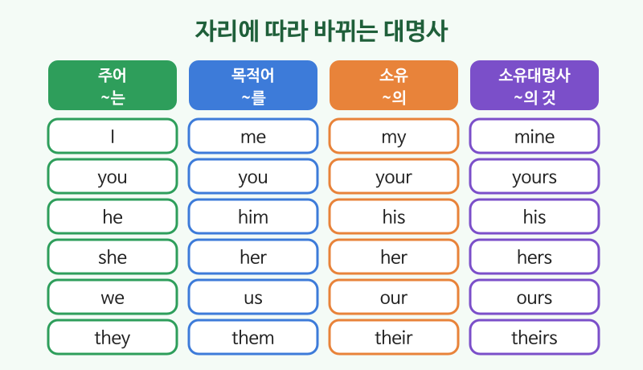

# 대명사 (I, me, my, mine)

## 이번 강의에서 배울 것

- 같은 사람을 가리켜도 문장 속 자리에 따라 모양이 바뀐다는 것 (I / me / my / mine)
- 사물과 동물은 it, 여럿은 they로 받는 규칙
- this / that / these / those로 가리키기

## 핵심 설명

대명사는 이미 말한 명사를 반복하지 않으려고 **대신 쓰는 말**입니다. 우리말은 "나는, 나를, 나의"처럼 조사만 바꾸지만, 영어는 **단어 자체가 바뀝니다**.

| 주어 (~는) | 목적어 (~를) | 소유 (~의) | 소유대명사 (~의 것) |
|---|---|---|---|
| I | me | my | mine |
| you | you | your | yours |
| he | him | his | his |
| she | her | her | hers |
| it | it | its | (거의 안 씀) |
| we | us | our | ours |
| they | them | their | theirs |

### 자리에 따라 바뀌는 모양

| 영어 | 한국어 | 듣기 |
|---|---|---|
| She called me yesterday. | 그녀가 어제 나에게 전화했다. | [🔊](audio/02-pronouns-01.mp3) [🐢](audio/02-pronouns-01-slow.mp3) |
| I called her back. | 내가 그녀에게 다시 전화했다. | [🔊](audio/02-pronouns-02.mp3) [🐢](audio/02-pronouns-02-slow.mp3) |
| This is my phone. | 이것은 내 전화기이다. | [🔊](audio/02-pronouns-03.mp3) [🐢](audio/02-pronouns-03-slow.mp3) |
| Is this pen yours? | 이 펜 당신 거예요? | [🔊](audio/02-pronouns-04.mp3) [🐢](audio/02-pronouns-04-slow.mp3) |
| We love our new house. | 우리는 새 집이 정말 좋다. | [🔊](audio/02-pronouns-05.mp3) [🐢](audio/02-pronouns-05-slow.mp3) |

### 가리키는 말

| | 가까이 | 멀리 |
|---|---|---|
| 하나 | this | that |
| 여럿 | these | those |

| 영어 | 한국어 | 듣기 |
|---|---|---|
| How much is this? | 이거 얼마예요? | [🔊](audio/02-pronouns-06.mp3) [🐢](audio/02-pronouns-06-slow.mp3) |
| Those shoes are nice. | 저 신발 멋지다. | [🔊](audio/02-pronouns-07.mp3) [🐢](audio/02-pronouns-07-slow.mp3) |

> 💡 전화나 소개에서 "저는 ○○입니다"는 **This is** ○○ 라고 말합니다. "Hello, this is Minsu."

## 자주 하는 실수

- ❌ Me and my wife live here. → ✅ My wife and I live here.
  - 주어 자리에는 me가 아니라 I를 씁니다. 다른 사람을 먼저 말하는 것이 예의입니다.
- ❌ Its a good idea. → ✅ It's a good idea.
  - it's는 it is의 줄임말, its는 "그것의"입니다.
- ❌ I like he. → ✅ I like him.
  - 동사 뒤(목적어 자리)에는 him, her, them을 씁니다.

## 연습 문제

괄호 안에서 알맞은 것을 고르세요.

1. (She / Her) works with (I / me).
2. Is this (your / yours) bag?
3. The bag is (my / mine).
4. I know (they / them) well.
5. The company changed (its / it's) name.

## 정답과 해설

1. **She / me**: 주어 자리는 She, 전치사 with 뒤는 목적어 me.
2. **your**: 뒤에 명사 bag이 있으므로 소유 your.
3. **mine**: 뒤에 명사가 없으므로 "나의 것" mine.
4. **them**: 동사 know 뒤 목적어 자리.
5. **its**: "그 회사의" 이름이므로 소유 its.

## 오늘의 단어

| 단어 | 뜻 | 예문 | 듣기 |
|---|---|---|---|
| call back | 다시 전화하다 | I'll call you back. | [🔊](audio/02-pronouns-w01.mp3) |
| company | 회사 | Our company is in Pangyo. | [🔊](audio/02-pronouns-w02.mp3) |
| idea | 생각, 아이디어 | That's a great idea. | [🔊](audio/02-pronouns-w03.mp3) |
| shoes | 신발 | These shoes are new. | [🔊](audio/02-pronouns-w04.mp3) |
| How much | 얼마 | How much are these? | [🔊](audio/02-pronouns-w05.mp3) |
