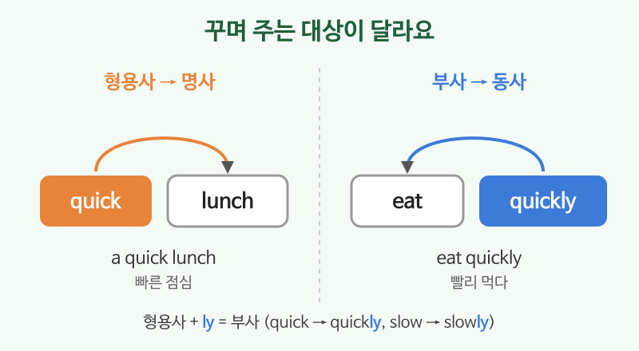

# 형용사와 부사 (quick, quickly)

## 이번 강의에서 배울 것

- 형용사는 **명사**를, 부사는 **동사·형용사·문장 전체**를 꾸민다는 것
- 형용사에 -ly를 붙여 부사 만들기
- 자주 쓰는 빈도부사(always, usually, sometimes, never)의 위치

## 핵심 설명

형용사는 "어떤" 사람이나 물건인지 말해 주고, 부사는 "어떻게, 얼마나, 얼마나 자주" 하는지 말해 줍니다.

| 형용사 (명사를 꾸밈) | 부사 (동사를 꾸밈) |
|---|---|
| a **quick** lunch (빠른 점심) | eat **quickly** (빨리 먹다) |
| a **careful** driver (조심스러운 운전자) | drive **carefully** (조심해서 운전하다) |
| a **good** cook (요리 잘하는 사람) | cook **well** (요리를 잘하다) |
| a **fast** train (빠른 기차) | run **fast** (빨리 달리다) |

- 대부분 형용사 + **ly** = 부사입니다. (slow → slowly, easy → easily)
- good의 부사는 **well**, fast와 hard는 모양이 같습니다.

### 형용사의 두 자리

| 영어 | 한국어 | 듣기 |
|---|---|---|
| It's a beautiful day. | (명사 앞) 날씨 좋은 날이다. | [🔊](audio/03-adjectives-adverbs-01.mp3) [🐢](audio/03-adjectives-adverbs-01-slow.mp3) |
| The soup is too salty. | (be동사 뒤) 수프가 너무 짜다. | [🔊](audio/03-adjectives-adverbs-02.mp3) [🐢](audio/03-adjectives-adverbs-02-slow.mp3) |

### 부사로 동작 설명하기

| 영어 | 한국어 | 듣기 |
|---|---|---|
| Please speak slowly. | 천천히 말해 주세요. | [🔊](audio/03-adjectives-adverbs-03.mp3) [🐢](audio/03-adjectives-adverbs-03-slow.mp3) |
| She speaks English well. | 그녀는 영어를 잘한다. | [🔊](audio/03-adjectives-adverbs-04.mp3) [🐢](audio/03-adjectives-adverbs-04-slow.mp3) |
| This is really important. | 이건 정말 중요하다. | [🔊](audio/03-adjectives-adverbs-05.mp3) [🐢](audio/03-adjectives-adverbs-05-slow.mp3) |

### 얼마나 자주: 빈도부사

빈도부사는 **일반동사 앞, be동사 뒤**에 둡니다.

| 영어 | 한국어 | 듣기 |
|---|---|---|
| I always take the subway. | 나는 항상 지하철을 탄다. | [🔊](audio/03-adjectives-adverbs-06.mp3) [🐢](audio/03-adjectives-adverbs-06-slow.mp3) |
| He is usually late. | 그는 보통 늦는다. | [🔊](audio/03-adjectives-adverbs-07.mp3) [🐢](audio/03-adjectives-adverbs-07-slow.mp3) |
| We sometimes eat out. | 우리는 가끔 외식한다. | [🔊](audio/03-adjectives-adverbs-08.mp3) [🐢](audio/03-adjectives-adverbs-08-slow.mp3) |

> 💡 자주 하는 순서: always(항상) > usually(보통) > often(자주) > sometimes(가끔) > never(전혀).

## 자주 하는 실수

- ❌ She speaks English very good. → ✅ She speaks English very well.
  - 동사(speaks)를 꾸미므로 부사 well을 씁니다.
- ❌ I go always to the gym. → ✅ I always go to the gym.
  - 빈도부사는 일반동사 앞에 옵니다.
- ❌ I'm very well tired. → ✅ I'm very tired.
  - 형용사를 꾸밀 때는 very, really, so 같은 부사를 씁니다.

## 연습 문제

괄호 안에서 알맞은 것을 고르세요.

1. He is a (careful / carefully) driver.
2. Please drive (careful / carefully).
3. The test was (easy / easily).
4. She sings (beautiful / beautifully).
5. (I never / Never I) drink soda.

## 정답과 해설

1. **careful**: 명사 driver를 꾸미는 형용사.
2. **carefully**: 동사 drive를 꾸미는 부사.
3. **easy**: be동사(was) 뒤에서 주어의 상태를 말하는 형용사.
4. **beautifully**: 동사 sings를 꾸미는 부사.
5. **I never**: 빈도부사는 주어 다음, 일반동사 앞.

## 오늘의 단어

| 단어 | 뜻 | 예문 | 듣기 |
|---|---|---|---|
| careful | 조심스러운 | Be careful! | [🔊](audio/03-adjectives-adverbs-w01.mp3) |
| salty | 짠 | The fries are salty. | [🔊](audio/03-adjectives-adverbs-w02.mp3) |
| important | 중요한 | This meeting is important. | [🔊](audio/03-adjectives-adverbs-w03.mp3) |
| subway | 지하철 | I take the subway to work. | [🔊](audio/03-adjectives-adverbs-w04.mp3) |
| eat out | 외식하다 | Let's eat out tonight. | [🔊](audio/03-adjectives-adverbs-w05.mp3) |
