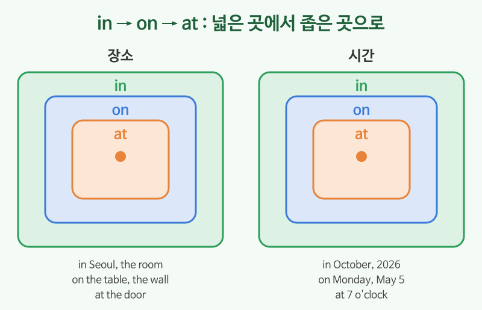

# 전치사 (in, on, at)

## 이번 강의에서 배울 것

- 장소를 말할 때 in, on, at의 차이
- 시간을 말할 때 in, on, at의 차이
- 자주 쓰는 장소 전치사 (next to, between, under, in front of)

## 핵심 설명

전치사는 명사 **앞**에 붙어서 장소나 시간을 알려 주는 말입니다. 가장 많이 쓰는 in, on, at은 **넓은 것에서 좁은 것** 순서로 기억하면 쉽습니다.

| | in (넓은 범위, 안) | on (면, 날짜) | at (한 점) |
|---|---|---|---|
| 장소 | in Seoul, in the room | on the table, on the wall | at the door, at the bus stop |
| 시간 | in October, in 2026, in the morning | on Monday, on May 5 | at 7 o'clock, at noon |

### 장소

| 영어 | 한국어 | 듣기 |
|---|---|---|
| I live in Incheon. | 나는 인천에 산다. | [🔊](audio/04-prepositions-01.mp3) [🐢](audio/04-prepositions-01-slow.mp3) |
| Your keys are on the table. | 네 열쇠는 탁자 위에 있어. | [🔊](audio/04-prepositions-02.mp3) [🐢](audio/04-prepositions-02-slow.mp3) |
| I'm at the bus stop. | 나 버스 정류장에 있어. | [🔊](audio/04-prepositions-03.mp3) [🐢](audio/04-prepositions-03-slow.mp3) |

### 시간

| 영어 | 한국어 | 듣기 |
|---|---|---|
| My birthday is in October. | 내 생일은 10월이다. | [🔊](audio/04-prepositions-04.mp3) [🐢](audio/04-prepositions-04-slow.mp3) |
| See you on Monday. | 월요일에 봐요. | [🔊](audio/04-prepositions-05.mp3) [🐢](audio/04-prepositions-05-slow.mp3) |
| The movie starts at seven thirty. | 영화는 7시 30분에 시작한다. | [🔊](audio/04-prepositions-06.mp3) [🐢](audio/04-prepositions-06-slow.mp3) |

### 위치를 나타내는 말

| 영어 | 한국어 | 듣기 |
|---|---|---|
| The bank is next to the cafe. | 은행은 카페 옆에 있다. | [🔊](audio/04-prepositions-07.mp3) [🐢](audio/04-prepositions-07-slow.mp3) |
| The cat is under the bed. | 고양이가 침대 밑에 있다. | [🔊](audio/04-prepositions-08.mp3) [🐢](audio/04-prepositions-08-slow.mp3) |
| Let's meet in front of the station. | 역 앞에서 만나자. | [🔊](audio/04-prepositions-09.mp3) [🐢](audio/04-prepositions-09-slow.mp3) |

> 💡 at night(밤에), at the weekend(영국식) / on the weekend(미국식), in the morning처럼 굳어진 표현은 통째로 외우는 것이 빠릅니다.

## 자주 하는 실수

- ❌ I'll see you in Monday. → ✅ I'll see you on Monday.
  - 요일과 날짜 앞에는 on을 씁니다.
- ❌ I go to home. → ✅ I go home.
  - home, here, there 앞에는 to를 쓰지 않습니다.
- ❌ I arrived to the airport. → ✅ I arrived at the airport.
  - arrive 뒤에는 장소에 따라 at(좁은 곳)이나 in(도시, 나라)을 씁니다.

## 연습 문제

빈칸에 in, on, at 중 알맞은 것을 넣으세요.

1. The meeting is ___ 3 p.m.
2. I was born ___ 1985.
3. There is a picture ___ the wall.
4. We have a party ___ Friday.
5. My sister works ___ Busan.

## 정답과 해설

1. **at**: 정확한 시각.
2. **in**: 연도는 넓은 범위.
3. **on**: 벽이라는 면 위.
4. **on**: 요일.
5. **in**: 도시는 넓은 범위.

## 오늘의 단어

| 단어 | 뜻 | 예문 | 듣기 |
|---|---|---|---|
| bus stop | 버스 정류장 | Wait at the bus stop. | [🔊](audio/04-prepositions-w01.mp3) |
| next to | ~옆에 | Sit next to me. | [🔊](audio/04-prepositions-w02.mp3) |
| in front of | ~앞에 | I'm in front of the building. | [🔊](audio/04-prepositions-w03.mp3) |
| station | 역 | Where is the station? | [🔊](audio/04-prepositions-w04.mp3) |
| arrive | 도착하다 | We arrived at the hotel. | [🔊](audio/04-prepositions-w05.mp3) |
