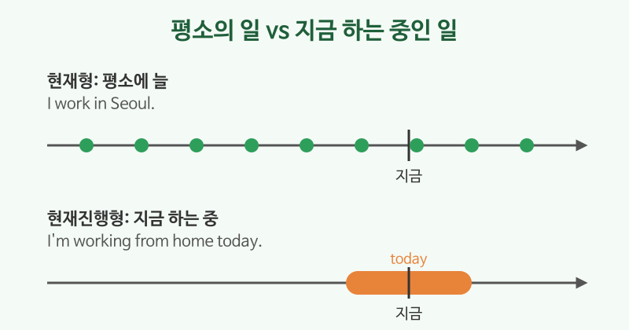

# 현재진행형 (I'm working)

## 이번 강의에서 배울 것

- **지금 이 순간** 하고 있는 일을 말하는 현재진행형 (be + 동사ing)
- -ing 붙이는 규칙
- 현재형(I work)과 현재진행형(I'm working)의 차이

## 핵심 설명

현재진행형은 **am / are / is + 동사ing** 로 만듭니다. "~하고 있다", "~하는 중이다"라는 뜻으로, 말하는 지금 진행 중인 일이나 요즘 잠시 하고 있는 일을 나타냅니다.

| 주어 | 긍정 | 부정 | 의문 |
|---|---|---|---|
| I | I'm working. | I'm not working. | Am I working? |
| You / We / They | You're working. | You aren't working. | Are you working? |
| He / She / It | She's working. | She isn't working. | Is she working? |

### -ing 붙이는 법

| 규칙 | 예 |
|---|---|
| 대부분: + ing | work → working, eat → eating |
| e로 끝나면: e를 빼고 + ing | make → making, write → writing |
| 짧은 모음 + 자음 하나로 끝나면: 자음을 한 번 더 | run → running, sit → sitting |
| ie로 끝나면: ie를 y로 + ing | lie → lying |

### 지금 하고 있는 일

| 영어 | 한국어 | 듣기 |
|---|---|---|
| I'm driving now. Can I call you later? | 지금 운전 중이야. 나중에 전화해도 될까? | [🔊](audio/01-present-continuous-01.mp3) [🐢](audio/01-present-continuous-01-slow.mp3) |
| She's talking on the phone. | 그녀는 통화 중이다. | [🔊](audio/01-present-continuous-02.mp3) [🐢](audio/01-present-continuous-02-slow.mp3) |
| It's raining outside. | 밖에 비가 오고 있다. | [🔊](audio/01-present-continuous-03.mp3) [🐢](audio/01-present-continuous-03-slow.mp3) |
| What are you doing? | 뭐 하고 있어? | [🔊](audio/01-present-continuous-04.mp3) [🐢](audio/01-present-continuous-04-slow.mp3) |

### 요즘 잠시 하고 있는 일

| 영어 | 한국어 | 듣기 |
|---|---|---|
| I'm learning English these days. | 요즘 영어를 배우고 있다. | [🔊](audio/01-present-continuous-05.mp3) [🐢](audio/01-present-continuous-05-slow.mp3) |
| We're staying at a hotel this week. | 이번 주에는 호텔에 묵고 있다. | [🔊](audio/01-present-continuous-06.mp3) [🐢](audio/01-present-continuous-06-slow.mp3) |

### 현재형과 비교

| 현재형 (평소, 늘) | 현재진행형 (지금, 요즘) |
|---|---|
| I **work** in Seoul. (서울에서 일한다) | I'**m working** from home today. (오늘은 재택 중이다) |
| He **drinks** coffee every day. | He'**s drinking** tea now. |

> 💡 like, know, want, have(가지다)처럼 **상태**를 나타내는 동사는 보통 진행형으로 쓰지 않습니다. I know him. (I'm knowing ❌)

## 자주 하는 실수

- ❌ I working now. → ✅ I'm working now.
  - be동사(am, are, is)를 빠뜨리지 마세요.
- ❌ I'm wanting a coffee. → ✅ I want a coffee.
  - want는 상태 동사라 진행형으로 쓰지 않습니다.
- ❌ She is runing. → ✅ She is running.
  - run은 자음 n을 한 번 더 씁니다.

## 연습 문제

괄호 안의 동사를 현재형 또는 현재진행형으로 바꾸세요.

1. Look! The baby ___ (sleep).
2. I usually ___ (take) the bus to work.
3. ___ you ___ (wait) for someone?
4. They ___ (not, watch) TV right now.
5. I ___ (know) the answer.

## 정답과 해설

1. **is sleeping**: Look!은 지금 눈앞의 일을 가리킵니다.
2. **take**: usually(보통)는 습관이므로 현재형.
3. **Are / waiting**: 지금 기다리는 중인지 묻습니다.
4. **aren't watching**: right now(바로 지금)의 부정.
5. **know**: know는 상태 동사라 진행형으로 쓰지 않습니다.

## 오늘의 단어

| 단어 | 뜻 | 예문 | 듣기 |
|---|---|---|---|
| right now | 바로 지금 | I'm busy right now. | [🔊](audio/01-present-continuous-w01.mp3) |
| these days | 요즘 | I'm reading a lot these days. | [🔊](audio/01-present-continuous-w02.mp3) |
| stay | 머무르다 | We're staying with friends. | [🔊](audio/01-present-continuous-w03.mp3) |
| wait for | ~을 기다리다 | I'm waiting for the bus. | [🔊](audio/01-present-continuous-w04.mp3) |
| later | 나중에 | Talk to you later. | [🔊](audio/01-present-continuous-w05.mp3) |
