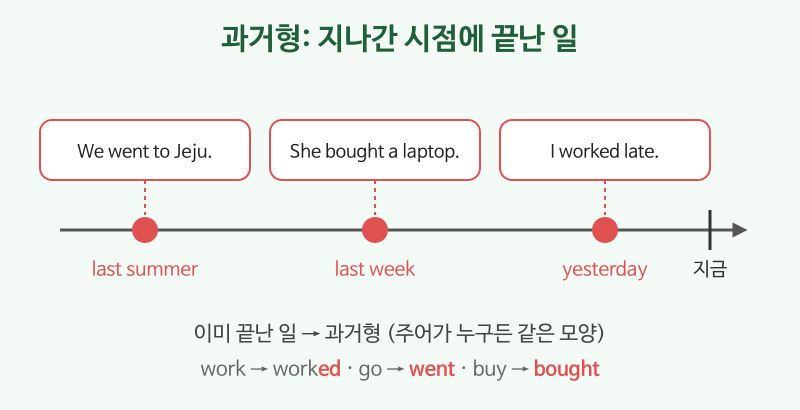

# 과거형 (I worked, I went)

## 이번 강의에서 배울 것

- 이미 끝난 일을 말하는 과거형
- 규칙 동사(-ed)와 자주 쓰는 불규칙 동사
- be동사의 과거(was, were)와 did로 만드는 부정문·의문문

## 핵심 설명

과거형은 **과거의 어느 시점에 끝난 일**을 말합니다. yesterday, last week, ago, in 2020처럼 과거 시점을 나타내는 말과 자주 함께 씁니다. 현재형과 달리 **주어가 누구든 모양이 같습니다**.

### 1) 규칙 동사: + ed

| 규칙 | 예 |
|---|---|
| 대부분: + ed | work → worked, call → called |
| e로 끝나면: + d | live → lived |
| 자음 + y: y를 i로 + ed | study → studied |
| 짧은 모음 + 자음: 자음을 한 번 더 | stop → stopped |

### 2) 자주 쓰는 불규칙 동사

| 현재 | 과거 | 현재 | 과거 |
|---|---|---|---|
| go | went | have | had |
| eat | ate | see | saw |
| buy | bought | take | took |
| make | made | come | came |
| get | got | say | said |

### 3) be동사의 과거

| 주어 | be동사 과거 |
|---|---|
| I / He / She / It | was |
| You / We / They | were |

### 예문

| 영어 | 한국어 | 듣기 |
|---|---|---|
| I worked late last night. | 어젯밤 늦게까지 일했다. | [🔊](audio/02-past-simple-01.mp3) [🐢](audio/02-past-simple-01-slow.mp3) |
| We went to Jeju last summer. | 지난여름 제주에 갔다. | [🔊](audio/02-past-simple-02.mp3) [🐢](audio/02-past-simple-02-slow.mp3) |
| She bought a new laptop. | 그녀는 새 노트북을 샀다. | [🔊](audio/02-past-simple-03.mp3) [🐢](audio/02-past-simple-03-slow.mp3) |
| The weather was great yesterday. | 어제 날씨가 정말 좋았다. | [🔊](audio/02-past-simple-04.mp3) [🐢](audio/02-past-simple-04-slow.mp3) |
| I didn't sleep well. | 잠을 잘 못 잤다. | [🔊](audio/02-past-simple-05.mp3) [🐢](audio/02-past-simple-05-slow.mp3) |
| Did you have lunch? | 점심 먹었어요? | [🔊](audio/02-past-simple-06.mp3) [🐢](audio/02-past-simple-06-slow.mp3) |
| Where were you this morning? | 오늘 아침에 어디 있었어요? | [🔊](audio/02-past-simple-07.mp3) [🐢](audio/02-past-simple-07-slow.mp3) |

> 💡 -ed 발음은 세 가지입니다. worked(트), lived(드), wanted(티드). 뒤 소리가 t나 d로 끝나는 동사만 "이드"로 한 음절이 늘어납니다.

## 자주 하는 실수

- ❌ I didn't went there. → ✅ I didn't go there.
  - didn't 뒤에는 동사원형을 씁니다.
- ❌ Did you saw it? → ✅ Did you see it?
  - Did로 물을 때도 동사는 원형입니다.
- ❌ I was go to the store. → ✅ I went to the store.
  - be동사 과거(was)와 일반동사를 함께 쓰지 않습니다.

## 연습 문제

괄호 안의 동사를 과거형으로 바꾸세요.

1. I ___ (meet) my old friend yesterday.
2. They ___ (be) very tired after the trip.
3. She ___ (not, come) to the party.
4. ___ you ___ (finish) your homework?
5. We ___ (stop) at a cafe on the way.

## 정답과 해설

1. **met**: meet는 불규칙 동사입니다. (meet → met)
2. **were**: They의 be동사 과거는 were.
3. **didn't come**: didn't + 원형.
4. **Did / finish**: Did + 주어 + 원형.
5. **stopped**: 짧은 모음 + 자음이라 p를 한 번 더.

## 오늘의 단어

| 단어 | 뜻 | 예문 | 듣기 |
|---|---|---|---|
| last night | 어젯밤 | I watched a movie last night. | [🔊](audio/02-past-simple-w01.mp3) |
| ago | ~전에 | I moved here two years ago. | [🔊](audio/02-past-simple-w02.mp3) |
| trip | 여행 | How was your trip? | [🔊](audio/02-past-simple-w03.mp3) |
| on the way | 가는 길에 | I bought coffee on the way. | [🔊](audio/02-past-simple-w04.mp3) |
| laptop | 노트북 컴퓨터 | My laptop is very old. | [🔊](audio/02-past-simple-w05.mp3) |
