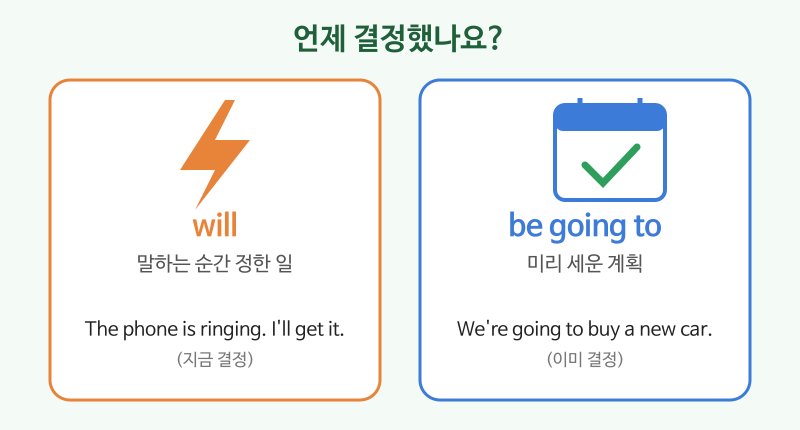

# 미래형 (will / be going to)

## 이번 강의에서 배울 것

- 앞으로의 일을 말하는 두 가지 방법: will과 be going to
- 그 자리에서 정한 일(will)과 미리 계획한 일(be going to)의 차이
- 확정된 약속을 말하는 현재진행형

## 핵심 설명

영어의 미래 표현은 하나가 아닙니다. **언제 결정했는지**에 따라 고르면 쉽습니다.

| 형태 | 쓰임 | 예 |
|---|---|---|
| will + 원형 | 말하는 순간 정한 일, 약속, 예측 | I'll call you. |
| be going to + 원형 | 미리 계획한 일, 눈앞의 증거로 하는 예측 | I'm going to visit my parents. |
| 현재진행형 | 날짜·시간이 정해진 약속 | I'm meeting Jun at six. |

### 1) will: 지금 정한 일, 약속

| 영어 | 한국어 | 듣기 |
|---|---|---|
| The phone is ringing. I'll get it. | 전화 온다. 내가 받을게. | [🔊](audio/03-future-01.mp3) [🐢](audio/03-future-01-slow.mp3) |
| I'll send you the file tonight. | 오늘 밤에 파일 보내 드릴게요. | [🔊](audio/03-future-02.mp3) [🐢](audio/03-future-02-slow.mp3) |
| I think it will be cold tomorrow. | 내일은 추울 것 같다. | [🔊](audio/03-future-03.mp3) [🐢](audio/03-future-03-slow.mp3) |
| I won't be late. | 늦지 않을게. | [🔊](audio/03-future-04.mp3) [🐢](audio/03-future-04-slow.mp3) |

### 2) be going to: 이미 세운 계획

| 영어 | 한국어 | 듣기 |
|---|---|---|
| We're going to buy a new car. | 우리는 새 차를 살 계획이다. | [🔊](audio/03-future-05.mp3) [🐢](audio/03-future-05-slow.mp3) |
| What are you going to do this weekend? | 이번 주말에 뭐 할 거예요? | [🔊](audio/03-future-06.mp3) [🐢](audio/03-future-06-slow.mp3) |
| Look at those clouds. It's going to rain. | 저 구름 좀 봐. 비 오겠다. | [🔊](audio/03-future-07.mp3) [🐢](audio/03-future-07-slow.mp3) |

### 3) 현재진행형: 정해진 약속

| 영어 | 한국어 | 듣기 |
|---|---|---|
| I'm seeing the doctor tomorrow morning. | 내일 아침에 병원 예약이 있다. | [🔊](audio/03-future-08.mp3) [🐢](audio/03-future-08-slow.mp3) |

> 💡 일상 대화에서 going to는 빠르게 **gonna**(거너)처럼 들립니다. 글로 쓸 때는 going to로 쓰세요.

## 자주 하는 실수

- ❌ I will to call you. → ✅ I will call you.
  - will 뒤에는 바로 동사원형을 씁니다.
- ❌ I going to study. → ✅ I'm going to study.
  - be going to의 be(am, are, is)를 빠뜨리지 마세요.
- ❌ Tomorrow I go to Busan. (계획을 말할 때) → ✅ Tomorrow I'm going to Busan.
  - 미래 계획은 현재형보다 be going to나 현재진행형이 자연스럽습니다.

## 연습 문제

will 또는 be going to 중 더 자연스러운 것을 넣으세요.

1. A: I don't have a pen. B: I ___ lend you mine.
2. I ___ start a new job next month. I signed the contract last week.
3. A: It's hot in here. B: I ___ open the window.
4. She ___ have a baby in May.
5. Don't worry. I ___ tell anyone.

## 정답과 해설

1. **'ll (will)**: 상대의 말을 듣고 그 자리에서 정했습니다.
2. **'m going to (am going to)**: 계약까지 마친 계획입니다.
3. **'ll (will)**: 말하는 순간 정한 일입니다.
4. **is going to**: 이미 정해진, 근거가 있는 미래입니다.
5. **won't (will not)**: 약속은 will로 말합니다.

## 오늘의 단어

| 단어 | 뜻 | 예문 | 듣기 |
|---|---|---|---|
| plan | 계획 | Do you have any plans tonight? | [🔊](audio/03-future-w01.mp3) |
| lend | 빌려주다 | Can you lend me some money? | [🔊](audio/03-future-w02.mp3) |
| contract | 계약(서) | I signed the contract. | [🔊](audio/03-future-w03.mp3) |
| tomorrow | 내일 | See you tomorrow. | [🔊](audio/03-future-w04.mp3) |
| worry | 걱정하다 | Don't worry about it. | [🔊](audio/03-future-w05.mp3) |
