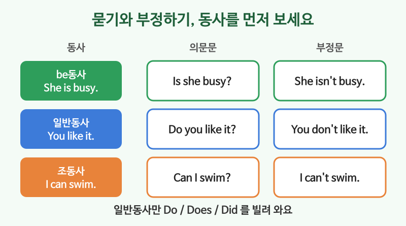

# 의문문과 부정문

## 이번 강의에서 배울 것

- 동사의 종류(be동사, 일반동사, 조동사)에 따라 의문문·부정문 만드는 법이 다르다는 것
- Yes / No로 짧게 대답하기
- 부가의문문(..., isn't it?)으로 확인하기

## 핵심 설명

영어 문장을 묻거나 부정할 때는 먼저 **동사가 무엇인지** 봅니다. 규칙은 세 가지뿐입니다.

| 동사 | 평서문 | 의문문 | 부정문 |
|---|---|---|---|
| be동사 | She is busy. | **Is she** busy? | She **is not (isn't)** busy. |
| 일반동사 | You like it. | **Do you** like it? | You **don't** like it. |
| 일반동사 (3인칭) | He works here. | **Does he** work here? | He **doesn't** work here. |
| 일반동사 (과거) | They came. | **Did they** come? | They **didn't** come. |
| 조동사 | I can swim. | **Can I** swim? | I **can't** swim. |

### 묻고 짧게 대답하기

대답할 때는 질문에 쓴 be동사나 do, can을 그대로 씁니다.

| 영어 | 한국어 | 듣기 |
|---|---|---|
| Are you ready? Yes, I am. | 준비됐어요? 네, 됐어요. | [🔊](audio/01-questions-negatives-01.mp3) [🐢](audio/01-questions-negatives-01-slow.mp3) |
| Is this seat taken? No, it isn't. | 이 자리 주인 있어요? 아니요, 없어요. | [🔊](audio/01-questions-negatives-02.mp3) [🐢](audio/01-questions-negatives-02-slow.mp3) |
| Do you have a minute? Sure, I do. | 잠깐 시간 있어요? 그럼요. | [🔊](audio/01-questions-negatives-03.mp3) [🐢](audio/01-questions-negatives-03-slow.mp3) |
| Did you lock the door? No, I didn't. | 문 잠갔어? 아니, 안 잠갔어. | [🔊](audio/01-questions-negatives-04.mp3) [🐢](audio/01-questions-negatives-04-slow.mp3) |
| Can you help me? Of course I can. | 좀 도와줄 수 있어요? 물론이죠. | [🔊](audio/01-questions-negatives-05.mp3) [🐢](audio/01-questions-negatives-05-slow.mp3) |

### 부정문

| 영어 | 한국어 | 듣기 |
|---|---|---|
| I'm not hungry. | 배 안 고파요. | [🔊](audio/01-questions-negatives-06.mp3) [🐢](audio/01-questions-negatives-06-slow.mp3) |
| I don't understand. | 이해가 안 돼요. | [🔊](audio/01-questions-negatives-07.mp3) [🐢](audio/01-questions-negatives-07-slow.mp3) |
| It doesn't matter. | 상관없어요. | [🔊](audio/01-questions-negatives-08.mp3) [🐢](audio/01-questions-negatives-08-slow.mp3) |

### 확인하는 질문: 부가의문문

문장 끝에 짧은 질문을 붙여 "그렇죠?" 하고 확인합니다. 앞이 긍정이면 뒤는 부정, 앞이 부정이면 뒤는 긍정입니다.

| 영어 | 한국어 | 듣기 |
|---|---|---|
| It's cold today, isn't it? | 오늘 춥네요, 그렇죠? | [🔊](audio/01-questions-negatives-09.mp3) [🐢](audio/01-questions-negatives-09-slow.mp3) |
| You don't eat meat, do you? | 고기 안 드시죠? | [🔊](audio/01-questions-negatives-10.mp3) [🐢](audio/01-questions-negatives-10-slow.mp3) |

> 💡 부정 질문에 대답할 때 주의하세요. "You don't eat meat, do you?"에 고기를 안 먹으면 **No, I don't.** 입니다. 우리말 "네, 안 먹어요"와 반대라 헷갈리기 쉽습니다.

## 자주 하는 실수

- ❌ You like coffee? (글에서) → ✅ Do you like coffee?
  - 말할 때 억양으로 묻기도 하지만, 기본은 Do로 시작합니다.
- ❌ Does she likes it? → ✅ Does she like it?
  - Does 뒤의 동사는 원형입니다.
- ❌ A: You're not tired? B: Yes, I'm not. → ✅ No, I'm not.
  - 영어는 내 대답이 부정이면 질문 모양과 상관없이 No입니다.

## 연습 문제

괄호 안의 지시대로 바꾸세요.

1. He is a teacher. (의문문)
2. They live in Daegu. (부정문)
3. She finished the work. (의문문)
4. You can drive. (의문문)
5. This is your coat. (부가의문문을 붙이세요)

## 정답과 해설

1. **Is he a teacher?**: be동사를 앞으로.
2. **They don't live in Daegu.**: 일반동사 현재, 주어 They → don't.
3. **Did she finish the work?**: 과거 → Did, 동사는 원형.
4. **Can you drive?**: 조동사를 앞으로.
5. **This is your coat, isn't it?**: 긍정문 뒤에는 부정 부가의문문. this는 it으로 받습니다.

## 오늘의 단어

| 단어 | 뜻 | 예문 | 듣기 |
|---|---|---|---|
| ready | 준비된 | Dinner is ready. | [🔊](audio/01-questions-negatives-w01.mp3) |
| seat | 자리, 좌석 | Please take a seat. | [🔊](audio/01-questions-negatives-w02.mp3) |
| lock | 잠그다 | Don't forget to lock the door. | [🔊](audio/01-questions-negatives-w03.mp3) |
| understand | 이해하다 | Do you understand? | [🔊](audio/01-questions-negatives-w04.mp3) |
| matter | 중요하다, 문제가 되다 | Your opinion matters. | [🔊](audio/01-questions-negatives-w05.mp3) |
