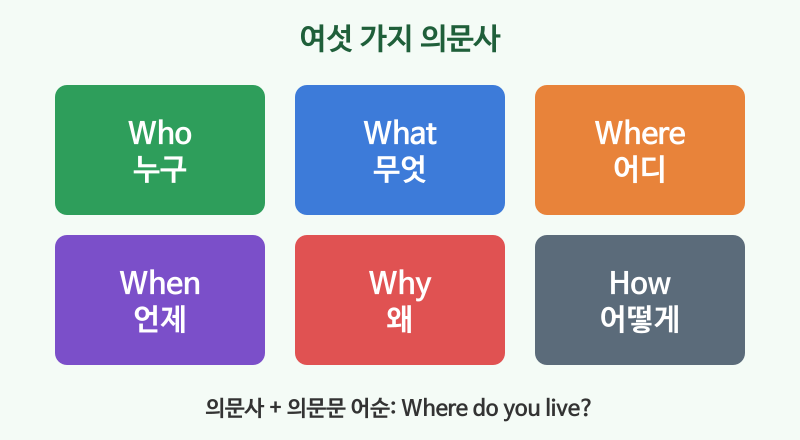

# 의문사 (who, what, where, when, why, how)

## 이번 강의에서 배울 것

- 여섯 가지 의문사의 뜻
- 의문사 + 의문문 어순 (Where do you live?)
- how much, how long, what time 같은 자주 쓰는 묶음

## 핵심 설명

Yes / No로 대답할 수 없는 질문은 **의문사**로 시작합니다. 만드는 법은 간단합니다. **의문사를 맨 앞에 놓고, 그 뒤는 의문문 어순**을 그대로 씁니다.

| 의문사 | 묻는 것 | 예 |
|---|---|---|
| who | 누구 | Who is that man? |
| what | 무엇 | What is your name? |
| where | 어디 | Where do you work? |
| when | 언제 | When does the store close? |
| why | 왜 | Why are you late? |
| how | 어떻게, 어떤 상태 | How was your weekend? |

### 기본 질문

| 영어 | 한국어 | 듣기 |
|---|---|---|
| Where are you from? | 어디 출신이에요? | [🔊](audio/02-wh-questions-01.mp3) [🐢](audio/02-wh-questions-01-slow.mp3) |
| What do you do? | 무슨 일 하세요? (직업) | [🔊](audio/02-wh-questions-02.mp3) [🐢](audio/02-wh-questions-02-slow.mp3) |
| Who is your favorite singer? | 제일 좋아하는 가수가 누구예요? | [🔊](audio/02-wh-questions-03.mp3) [🐢](audio/02-wh-questions-03-slow.mp3) |
| When is your birthday? | 생일이 언제예요? | [🔊](audio/02-wh-questions-04.mp3) [🐢](audio/02-wh-questions-04-slow.mp3) |
| Why did you choose this job? | 왜 이 일을 택했어요? | [🔊](audio/02-wh-questions-05.mp3) [🐢](audio/02-wh-questions-05-slow.mp3) |
| How do you go to work? | 출근은 어떻게 해요? | [🔊](audio/02-wh-questions-06.mp3) [🐢](audio/02-wh-questions-06-slow.mp3) |

### 자주 쓰는 묶음

| 영어 | 한국어 | 듣기 |
|---|---|---|
| What time is it? | 몇 시예요? | [🔊](audio/02-wh-questions-07.mp3) [🐢](audio/02-wh-questions-07-slow.mp3) |
| How much is this bag? | 이 가방 얼마예요? | [🔊](audio/02-wh-questions-08.mp3) [🐢](audio/02-wh-questions-08-slow.mp3) |
| How long does it take? | 얼마나 걸려요? | [🔊](audio/02-wh-questions-09.mp3) [🐢](audio/02-wh-questions-09-slow.mp3) |
| How often do you exercise? | 운동은 얼마나 자주 해요? | [🔊](audio/02-wh-questions-10.mp3) [🐢](audio/02-wh-questions-10-slow.mp3) |
| Which one do you want? | 어느 것을 원하세요? | [🔊](audio/02-wh-questions-11.mp3) [🐢](audio/02-wh-questions-11-slow.mp3) |

> 💡 "무슨 일 하세요?"를 What is your job?이라고 해도 틀리진 않지만, 원어민은 **What do you do?** 를 훨씬 많이 씁니다.

## 자주 하는 실수

- ❌ Where you live? → ✅ Where do you live?
  - 의문사 뒤에도 의문문 어순(do + 주어 + 동사)이 필요합니다.
- ❌ What time the meeting starts? → ✅ What time does the meeting start?
- ❌ How do you think? (의견을 물을 때) → ✅ What do you think?
  - "어떻게 생각해요?"는 what으로 묻습니다. 우리말과 다른 대표적인 표현입니다.

## 연습 문제

빈칸에 알맞은 의문사를 넣으세요.

1. ___ is the restroom? It's on the second floor.
2. ___ did you meet him? Last year.
3. ___ is calling? It's your mom.
4. ___ are you so happy? I got a new job!
5. ___ much is the ticket? It's 20 dollars.

## 정답과 해설

1. **Where**: 장소를 묻습니다.
2. **When**: 시간을 묻습니다.
3. **Who**: 사람을 묻습니다.
4. **Why**: 이유를 묻습니다.
5. **How**: How much는 가격을 묻습니다.

## 오늘의 단어

| 단어 | 뜻 | 예문 | 듣기 |
|---|---|---|---|
| favorite | 가장 좋아하는 | Pizza is my favorite food. | [🔊](audio/02-wh-questions-w01.mp3) |
| choose | 고르다, 택하다 | You can choose any color. | [🔊](audio/02-wh-questions-w02.mp3) |
| exercise | 운동하다 | I exercise three times a week. | [🔊](audio/02-wh-questions-w03.mp3) |
| restroom | 화장실 | Where is the restroom? | [🔊](audio/02-wh-questions-w04.mp3) |
| take (시간) | 걸리다 | It takes ten minutes. | [🔊](audio/02-wh-questions-w05.mp3) |
