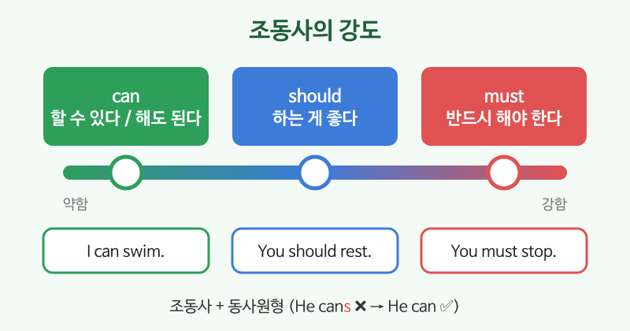

# 조동사 기초 (can, must, should)

## 이번 강의에서 배울 것

- 조동사는 동사 앞에서 **능력, 허락, 의무, 조언**의 뜻을 더한다는 것
- can, must, should, have to의 뜻과 차이
- Can I ...? / Could you ...?로 공손하게 부탁하기

## 핵심 설명

조동사는 동사를 "도와주는" 말입니다. 모양 규칙은 두 가지만 기억하면 됩니다. **조동사 뒤에는 항상 동사원형**, 그리고 **주어가 He, She여도 -s를 붙이지 않습니다.**

| 조동사 | 뜻 | 예 |
|---|---|---|
| can | ~할 수 있다 (능력), ~해도 된다 (허락) | I can speak Chinese. |
| should | ~하는 게 좋다 (조언) | You should rest. |
| must | 반드시 ~해야 한다 (강한 의무, 규칙) | You must wear a seat belt. |
| have to | ~해야 한다 (사정상 필요) | I have to work tomorrow. |

### can: 능력과 허락

| 영어 | 한국어 | 듣기 |
|---|---|---|
| She can play the piano. | 그녀는 피아노를 칠 줄 안다. | [🔊](audio/03-modals-01.mp3) [🐢](audio/03-modals-01-slow.mp3) |
| I can't come tonight. | 오늘 밤엔 못 가요. | [🔊](audio/03-modals-02.mp3) [🐢](audio/03-modals-02-slow.mp3) |
| Can I use your charger? | 충전기 좀 써도 돼요? | [🔊](audio/03-modals-03.mp3) [🐢](audio/03-modals-03-slow.mp3) |
| Could you say that again? | 다시 한 번 말씀해 주시겠어요? | [🔊](audio/03-modals-04.mp3) [🐢](audio/03-modals-04-slow.mp3) |

### should: 조언

| 영어 | 한국어 | 듣기 |
|---|---|---|
| You should see a doctor. | 병원에 가 보는 게 좋겠어요. | [🔊](audio/03-modals-05.mp3) [🐢](audio/03-modals-05-slow.mp3) |
| We shouldn't be late. | 늦으면 안 되겠어요. | [🔊](audio/03-modals-06.mp3) [🐢](audio/03-modals-06-slow.mp3) |

### must와 have to: 의무

| 영어 | 한국어 | 듣기 |
|---|---|---|
| Passengers must show their tickets. | 승객은 반드시 표를 보여 주어야 합니다. | [🔊](audio/03-modals-07.mp3) [🐢](audio/03-modals-07-slow.mp3) |
| I have to get up early tomorrow. | 내일 일찍 일어나야 한다. | [🔊](audio/03-modals-08.mp3) [🐢](audio/03-modals-08-slow.mp3) |
| You don't have to pay. It's free. | 돈 안 내셔도 돼요. 무료예요. | [🔊](audio/03-modals-09.mp3) [🐢](audio/03-modals-09-slow.mp3) |

> 💡 **mustn't**는 "절대 하면 안 된다", **don't have to**는 "안 해도 된다"입니다. 뜻이 완전히 다르니 주의하세요.

## 자주 하는 실수

- ❌ He cans drive. → ✅ He can drive.
  - 조동사에는 -s를 붙이지 않습니다.
- ❌ You should to rest. → ✅ You should rest.
  - 조동사 뒤에는 to 없이 바로 동사원형을 씁니다. (have to만 예외)
- ❌ I must go to the dentist? (물을 때) → ✅ Do I have to go to the dentist?
  - 의무를 물을 때는 보통 Do I have to ...?를 씁니다.

## 연습 문제

빈칸에 can, can't, should, mustn't, don't have to 중 알맞은 것을 넣으세요.

1. I ___ swim. I never learned.
2. You look tired. You ___ go to bed early.
3. You ___ smoke here. It's against the law.
4. It's Saturday. I ___ go to work.
5. ___ I open the window?

## 정답과 해설

1. **can't**: 배운 적이 없으니 할 수 없습니다.
2. **should**: 조언입니다.
3. **mustn't**: 법으로 금지된 일이라 "절대 하면 안 된다"입니다.
4. **don't have to**: 토요일이라 출근할 필요가 없습니다.
5. **Can**: 허락을 구합니다.

## 오늘의 단어

| 단어 | 뜻 | 예문 | 듣기 |
|---|---|---|---|
| charger | 충전기 | I forgot my charger. | [🔊](audio/03-modals-w01.mp3) |
| rest | 쉬다 | You need to rest. | [🔊](audio/03-modals-w02.mp3) |
| passenger | 승객 | The bus has ten passengers. | [🔊](audio/03-modals-w03.mp3) |
| free | 무료의 | The coffee is free. | [🔊](audio/03-modals-w04.mp3) |
| law | 법 | It's against the law. | [🔊](audio/03-modals-w05.mp3) |
