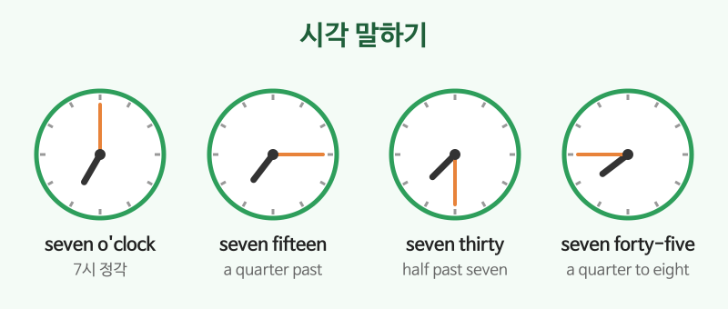

# 숫자·날짜·시간

## 이번 강의에서 배울 것

- 큰 숫자, 가격, 전화번호 읽기
- 요일, 달, 날짜(서수) 말하기
- 시각을 말하는 두 가지 방법 (seven thirty / half past seven)

## 핵심 설명

숫자와 시간은 예약, 쇼핑, 약속 등 모든 상황에서 나옵니다. 읽는 규칙을 한 번 정리해 두면 듣기도 훨씬 쉬워집니다.

### 1) 숫자 읽기

| 숫자 | 읽기 |
|---|---|
| 13 / 30 | thirteen (강세 뒤) / thirty (강세 앞) |
| 115 | one hundred (and) fifteen |
| 2,500 | two thousand five hundred |
| 38,000 | thirty-eight thousand |
| 1,200,000 | one million two hundred thousand |

| 영어 | 한국어 | 듣기 |
|---|---|---|
| It's twenty-five dollars. | 25달러입니다. | [🔊](audio/01-numbers-time-01.mp3) [🐢](audio/01-numbers-time-01-slow.mp3) |
| The rent is one thousand two hundred dollars a month. | 월세는 한 달에 1,200달러이다. | [🔊](audio/01-numbers-time-02.mp3) [🐢](audio/01-numbers-time-02-slow.mp3) |
| My number is oh one oh, two three four five, six seven eight nine. | 제 번호는 010-2345-6789입니다. | [🔊](audio/01-numbers-time-03.mp3) [🐢](audio/01-numbers-time-03-slow.mp3) |

> 💡 전화번호는 한 자리씩 읽습니다. 0은 보통 **oh**(오우)라고 읽고, 같은 숫자가 두 번이면 double을 쓰기도 합니다. (55 → double five)

### 2) 요일과 달

| 요일 | | 달 | |
|---|---|---|---|
| Monday | 월 | January / February / March | 1 / 2 / 3월 |
| Tuesday | 화 | April / May / June | 4 / 5 / 6월 |
| Wednesday | 수 | July / August / September | 7 / 8 / 9월 |
| Thursday | 목 | October / November / December | 10 / 11 / 12월 |
| Friday / Saturday / Sunday | 금 / 토 / 일 | | |

날짜는 **서수**(첫째, 둘째)로 읽습니다. 1st first, 2nd second, 3rd third, 4th fourth, 20th twentieth, 21st twenty-first.

| 영어 | 한국어 | 듣기 |
|---|---|---|
| Today is Friday, October ninth. | 오늘은 10월 9일 금요일이다. | [🔊](audio/01-numbers-time-04.mp3) [🐢](audio/01-numbers-time-04-slow.mp3) |
| My birthday is on March third. | 내 생일은 3월 3일이다. | [🔊](audio/01-numbers-time-05.mp3) [🐢](audio/01-numbers-time-05-slow.mp3) |

### 3) 시각

| 영어 | 한국어 | 듣기 |
|---|---|---|
| It's seven o'clock. | 7시 정각이다. | [🔊](audio/01-numbers-time-06.mp3) [🐢](audio/01-numbers-time-06-slow.mp3) |
| It's seven fifteen. It's a quarter past seven. | 7시 15분이다. | [🔊](audio/01-numbers-time-07.mp3) [🐢](audio/01-numbers-time-07-slow.mp3) |
| It's seven thirty. It's half past seven. | 7시 30분이다. | [🔊](audio/01-numbers-time-08.mp3) [🐢](audio/01-numbers-time-08-slow.mp3) |
| It's seven forty-five. It's a quarter to eight. | 7시 45분이다. (8시 15분 전) | [🔊](audio/01-numbers-time-09.mp3) [🐢](audio/01-numbers-time-09-slow.mp3) |
| The train leaves at six a.m. | 기차는 오전 6시에 떠난다. | [🔊](audio/01-numbers-time-10.mp3) [🐢](audio/01-numbers-time-10-slow.mp3) |

## 자주 하는 실수

- ❌ thirteen과 thirty를 같은 강세로 발음 → ✅ thir**TEEN** / **THIR**ty
  - 가격을 말할 때 특히 중요합니다. 13달러와 30달러는 강세로 구별합니다.
- ❌ October 9 를 "October nine"으로 읽기 → ✅ October ninth
  - 날짜는 서수로 읽습니다.
- ❌ It's 7 hours. → ✅ It's seven o'clock.
  - 시각에는 hour를 쓰지 않습니다.

## 연습 문제

영어로 읽어 보세요.

1. 47
2. 3,600
3. 12월 25일
4. 9시 30분 (두 가지로)
5. 오후 2시 45분

## 정답과 해설

1. **forty-seven**
2. **three thousand six hundred**
3. **December twenty-fifth**
4. **nine thirty / half past nine**
5. **two forty-five p.m. / a quarter to three in the afternoon**

## 오늘의 단어

| 단어 | 뜻 | 예문 | 듣기 |
|---|---|---|---|
| o'clock | ~시 정각 | Let's meet at ten o'clock. | [🔊](audio/01-numbers-time-w01.mp3) |
| quarter | 15분, 4분의 1 | It's a quarter past nine. | [🔊](audio/01-numbers-time-w02.mp3) |
| rent | 월세, 집세 | The rent is too high. | [🔊](audio/01-numbers-time-w03.mp3) |
| date | 날짜 | What's the date today? | [🔊](audio/01-numbers-time-w04.mp3) |
| leave | 떠나다, 출발하다 | The bus leaves in five minutes. | [🔊](audio/01-numbers-time-w05.mp3) |
