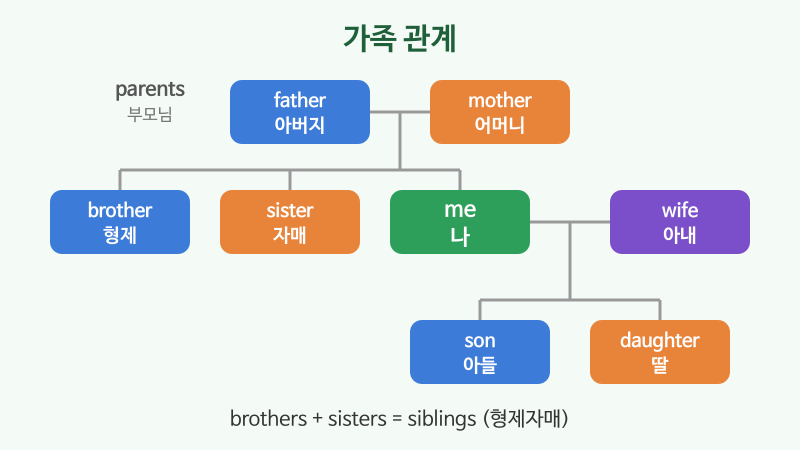

# 가족·직업

## 이번 강의에서 배울 것

- 가족을 부르는 단어 (parents, siblings, in-laws)
- 자주 쓰는 직업 이름과 "무슨 일 하세요?"에 대답하기
- 가족과 직업을 넣어 자기소개하기

## 핵심 설명

처음 만난 사람과의 대화는 대부분 가족과 직업 이야기로 이어집니다. 자주 쓰는 단어를 묶어서 익혀 두세요.

### 1) 가족

| 영어 | 한국어 | 듣기 |
|---|---|---|
| parents | 부모님 | [🔊](audio/02-family-jobs-01.mp3) [🐢](audio/02-family-jobs-01-slow.mp3) |
| husband, wife | 남편, 아내 | [🔊](audio/02-family-jobs-02.mp3) [🐢](audio/02-family-jobs-02-slow.mp3) |
| son, daughter | 아들, 딸 | [🔊](audio/02-family-jobs-03.mp3) [🐢](audio/02-family-jobs-03-slow.mp3) |
| brother, sister | 형제(형·오빠·남동생), 자매(누나·언니·여동생) | [🔊](audio/02-family-jobs-04.mp3) [🐢](audio/02-family-jobs-04-slow.mp3) |
| grandparents | 조부모님 | [🔊](audio/02-family-jobs-05.mp3) [🐢](audio/02-family-jobs-05-slow.mp3) |
| mother-in-law | 시어머니, 장모님 | [🔊](audio/02-family-jobs-06.mp3) [🐢](audio/02-family-jobs-06-slow.mp3) |

> 💡 영어는 나이 위아래를 잘 구분하지 않습니다. 꼭 구분하고 싶으면 **older brother**(형, 오빠), **younger sister**(여동생)처럼 말합니다.

| 영어 | 한국어 | 듣기 |
|---|---|---|
| I have one older brother and two younger sisters. | 형이 한 명, 여동생이 두 명 있다. | [🔊](audio/02-family-jobs-07.mp3) [🐢](audio/02-family-jobs-07-slow.mp3) |
| I'm married with two kids. | 결혼했고 아이가 둘 있다. | [🔊](audio/02-family-jobs-08.mp3) [🐢](audio/02-family-jobs-08-slow.mp3) |

### 2) 직업

| 영어 | 한국어 | 듣기 |
|---|---|---|
| office worker, accountant | 회사원, 회계사 | [🔊](audio/02-family-jobs-09.mp3) [🐢](audio/02-family-jobs-09-slow.mp3) |
| teacher, nurse, doctor | 교사, 간호사, 의사 | [🔊](audio/02-family-jobs-10.mp3) [🐢](audio/02-family-jobs-10-slow.mp3) |
| salesperson, designer, developer | 영업직, 디자이너, 개발자 | [🔊](audio/02-family-jobs-11.mp3) [🐢](audio/02-family-jobs-11-slow.mp3) |
| civil servant, business owner | 공무원, 자영업자 | [🔊](audio/02-family-jobs-12.mp3) [🐢](audio/02-family-jobs-12-slow.mp3) |

### 3) 직업 말하기

| 영어 | 한국어 | 듣기 |
|---|---|---|
| What do you do? | 무슨 일 하세요? | [🔊](audio/02-family-jobs-13.mp3) [🐢](audio/02-family-jobs-13-slow.mp3) |
| I'm a nurse. I work at a hospital. | 간호사예요. 병원에서 일해요. | [🔊](audio/02-family-jobs-14.mp3) [🐢](audio/02-family-jobs-14-slow.mp3) |
| I work in marketing. | 마케팅 분야에서 일해요. | [🔊](audio/02-family-jobs-15.mp3) [🐢](audio/02-family-jobs-15-slow.mp3) |
| I'm retired. | 은퇴했어요. | [🔊](audio/02-family-jobs-16.mp3) [🐢](audio/02-family-jobs-16-slow.mp3) |

> 💡 work **at** + 회사·장소 (at Samsung, at a bank), work **in** + 분야 (in sales, in IT), work **for** + 고용주 (for a small company).

## 자주 하는 실수

- ❌ I'm office worker. → ✅ I'm an office worker.
  - 직업 앞에는 a/an이 필요합니다.
- ❌ My mother and father are my parent. → ✅ ... are my parents.
  - 부모님 두 분은 parents입니다.
- ❌ I work at marketing. → ✅ I work in marketing.
  - 분야 앞에는 in을 씁니다.

## 연습 문제

영어로 말해 보세요.

1. 저는 개발자이고 IT 회사에서 일해요.
2. 남동생이 한 명 있어요.
3. 아직 결혼 안 했어요.
4. 저희 아버지는 은퇴하셨어요.
5. 무슨 일 하세요?

## 정답과 해설

1. **I'm a developer. I work at an IT company.**
2. **I have a younger brother.**
3. **I'm not married yet.** 또는 **I'm single.**
4. **My father is retired.**
5. **What do you do?**

## 오늘의 단어

| 단어 | 뜻 | 예문 | 듣기 |
|---|---|---|---|
| married | 결혼한 | Are you married? | [🔊](audio/02-family-jobs-w01.mp3) |
| single | 미혼의 | I'm still single. | [🔊](audio/02-family-jobs-w02.mp3) |
| retired | 은퇴한 | My parents are retired. | [🔊](audio/02-family-jobs-w03.mp3) |
| siblings | 형제자매 | Do you have any siblings? | [🔊](audio/02-family-jobs-w04.mp3) |
| hospital | 병원 | She works at a hospital. | [🔊](audio/02-family-jobs-w05.mp3) |
