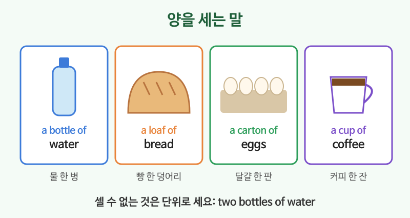

# 음식·쇼핑

## 이번 강의에서 배울 것

- 음식, 맛, 식사와 관련된 기본 단어
- 가게에서 물건 찾기, 가격 묻기, 입어 보기
- 셀 수 없는 음식의 양을 말하는 표현 (a bottle of, a piece of)

## 핵심 설명

장보기, 식당, 옷 가게처럼 매일 쓰는 단어들입니다. 단어와 함께 **바로 쓸 수 있는 문장**을 같이 익히세요.

### 1) 음식과 맛

| 영어 | 한국어 | 듣기 |
|---|---|---|
| breakfast, lunch, dinner | 아침, 점심, 저녁 식사 | [🔊](audio/03-food-shopping-01.mp3) [🐢](audio/03-food-shopping-01-slow.mp3) |
| vegetables, fruit, meat | 채소, 과일, 고기 | [🔊](audio/03-food-shopping-02.mp3) [🐢](audio/03-food-shopping-02-slow.mp3) |
| sweet, salty, spicy, sour | 단, 짠, 매운, 신 | [🔊](audio/03-food-shopping-03.mp3) [🐢](audio/03-food-shopping-03-slow.mp3) |
| delicious, fresh | 맛있는, 신선한 | [🔊](audio/03-food-shopping-04.mp3) [🐢](audio/03-food-shopping-04-slow.mp3) |
| Is it spicy? | 매워요? | [🔊](audio/03-food-shopping-05.mp3) [🐢](audio/03-food-shopping-05-slow.mp3) |

### 2) 양을 세는 말

| 영어 | 한국어 | 듣기 |
|---|---|---|
| a bottle of water | 물 한 병 | [🔊](audio/03-food-shopping-06.mp3) [🐢](audio/03-food-shopping-06-slow.mp3) |
| a cup of coffee | 커피 한 잔 | [🔊](audio/03-food-shopping-07.mp3) [🐢](audio/03-food-shopping-07-slow.mp3) |
| a piece of cake | 케이크 한 조각 | [🔊](audio/03-food-shopping-08.mp3) [🐢](audio/03-food-shopping-08-slow.mp3) |
| a loaf of bread | 빵 한 덩어리 | [🔊](audio/03-food-shopping-09.mp3) [🐢](audio/03-food-shopping-09-slow.mp3) |
| a carton of eggs | 달걀 한 판(상자) | [🔊](audio/03-food-shopping-10.mp3) [🐢](audio/03-food-shopping-10-slow.mp3) |

### 3) 가게에서

| 영어 | 한국어 | 듣기 |
|---|---|---|
| Where can I find the milk? | 우유는 어디 있어요? | [🔊](audio/03-food-shopping-11.mp3) [🐢](audio/03-food-shopping-11-slow.mp3) |
| I'm just looking, thanks. | 그냥 구경하는 거예요. | [🔊](audio/03-food-shopping-12.mp3) [🐢](audio/03-food-shopping-12-slow.mp3) |
| Can I try this on? | 이거 입어 봐도 돼요? | [🔊](audio/03-food-shopping-13.mp3) [🐢](audio/03-food-shopping-13-slow.mp3) |
| Do you have this in a larger size? | 이거 더 큰 사이즈 있어요? | [🔊](audio/03-food-shopping-14.mp3) [🐢](audio/03-food-shopping-14-slow.mp3) |
| It's on sale. Thirty percent off. | 세일 중이에요. 30퍼센트 할인이요. | [🔊](audio/03-food-shopping-15.mp3) [🐢](audio/03-food-shopping-15-slow.mp3) |
| Can I get a refund? | 환불 받을 수 있나요? | [🔊](audio/03-food-shopping-16.mp3) [🐢](audio/03-food-shopping-16-slow.mp3) |

> 💡 점원이 "Can I help you?"라고 물으면 둘러보는 중일 때는 "I'm just looking, thanks."라고 말하면 됩니다.

## 자주 하는 실수

- ❌ Give me two waters. (가게에서) → ✅ Can I get two bottles of water?
  - 셀 수 없는 명사는 단위(bottle, cup)로 셉니다. (식당에서 "two waters"는 흔히 쓰지만, 기본형을 먼저 익히세요.)
- ❌ This is very delicious. → ✅ This is really delicious. / This is so good.
  - delicious는 이미 "아주 맛있는"이라 very와 잘 어울리지 않습니다.
- ❌ Can I wear this? (가게에서) → ✅ Can I try this on?
  - 입어 보는 것은 try on입니다.

## 연습 문제

영어로 말해 보세요.

1. 커피 두 잔 주세요.
2. 이거 너무 짜요.
3. 이 셔츠 입어 봐도 될까요?
4. 더 작은 사이즈 있어요?
5. 영수증 있어요? 환불하고 싶어요.

## 정답과 해설

1. **Two cups of coffee, please.** 또는 **Can I get two coffees?**
2. **This is too salty.**
3. **Can I try this shirt on?**
4. **Do you have this in a smaller size?**
5. **Here's my receipt. I'd like a refund.**

## 오늘의 단어

| 단어 | 뜻 | 예문 | 듣기 |
|---|---|---|---|
| spicy | 매운 | I love spicy food. | [🔊](audio/03-food-shopping-w01.mp3) |
| try on | 입어 보다 | Can I try these shoes on? | [🔊](audio/03-food-shopping-w02.mp3) |
| on sale | 세일 중인 | These jeans are on sale. | [🔊](audio/03-food-shopping-w03.mp3) |
| receipt | 영수증 | Do you need a receipt? | [🔊](audio/03-food-shopping-w04.mp3) |
| refund | 환불 | I'd like a refund, please. | [🔊](audio/03-food-shopping-w05.mp3) |
