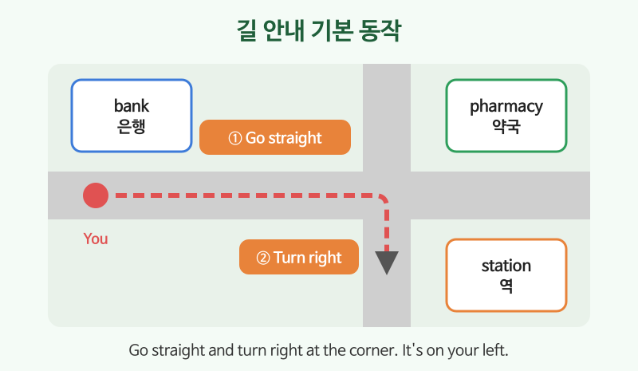

# 장소·교통

## 이번 강의에서 배울 것

- 동네에서 자주 가는 장소 이름
- 지하철, 버스, 택시를 탈 때 쓰는 단어와 문장
- 길을 묻고 알려 주는 기본 표현 (turn left, go straight)

## 핵심 설명

여행이나 출장에서 가장 먼저 필요한 것이 장소와 교통 표현입니다. 길 안내는 몇 가지 동작(직진, 좌회전, 우회전)만 알면 대부분 해결됩니다.

### 1) 장소

| 영어 | 한국어 | 듣기 |
|---|---|---|
| bank, post office, pharmacy | 은행, 우체국, 약국 | [🔊](audio/04-places-transport-01.mp3) [🐢](audio/04-places-transport-01-slow.mp3) |
| supermarket, convenience store | 슈퍼마켓, 편의점 | [🔊](audio/04-places-transport-02.mp3) [🐢](audio/04-places-transport-02-slow.mp3) |
| hospital, police station | 병원, 경찰서 | [🔊](audio/04-places-transport-03.mp3) [🐢](audio/04-places-transport-03-slow.mp3) |
| subway station, bus stop, airport | 지하철역, 버스 정류장, 공항 | [🔊](audio/04-places-transport-04.mp3) [🐢](audio/04-places-transport-04-slow.mp3) |

### 2) 교통

| 영어 | 한국어 | 듣기 |
|---|---|---|
| Which line goes to the airport? | 공항 가는 건 몇 호선이에요? | [🔊](audio/04-places-transport-05.mp3) [🐢](audio/04-places-transport-05-slow.mp3) |
| Where do I transfer? | 어디서 갈아타요? | [🔊](audio/04-places-transport-06.mp3) [🐢](audio/04-places-transport-06-slow.mp3) |
| Does this bus go downtown? | 이 버스 시내로 가요? | [🔊](audio/04-places-transport-07.mp3) [🐢](audio/04-places-transport-07-slow.mp3) |
| Please take me to this address. | 이 주소로 가 주세요. | [🔊](audio/04-places-transport-08.mp3) [🐢](audio/04-places-transport-08-slow.mp3) |
| Can you stop here, please? | 여기서 세워 주시겠어요? | [🔊](audio/04-places-transport-09.mp3) [🐢](audio/04-places-transport-09-slow.mp3) |

> 💡 "타다"는 탈것에 따라 다릅니다. 버스·지하철·기차·비행기는 **get on / get off**, 택시·자동차는 **get in / get out of**.

### 3) 길 묻고 알려 주기

| 영어 | 한국어 | 듣기 |
|---|---|---|
| Excuse me, how do I get to the station? | 실례합니다, 역에 어떻게 가요? | [🔊](audio/04-places-transport-10.mp3) [🐢](audio/04-places-transport-10-slow.mp3) |
| Is there a pharmacy near here? | 이 근처에 약국 있어요? | [🔊](audio/04-places-transport-11.mp3) [🐢](audio/04-places-transport-11-slow.mp3) |
| Go straight for two blocks. | 두 블록 직진하세요. | [🔊](audio/04-places-transport-12.mp3) [🐢](audio/04-places-transport-12-slow.mp3) |
| Turn left at the corner. | 모퉁이에서 왼쪽으로 도세요. | [🔊](audio/04-places-transport-13.mp3) [🐢](audio/04-places-transport-13-slow.mp3) |
| It's on your right, across from the bank. | 오른쪽에 있어요, 은행 맞은편이에요. | [🔊](audio/04-places-transport-14.mp3) [🐢](audio/04-places-transport-14-slow.mp3) |
| It's about a ten-minute walk. | 걸어서 10분 정도예요. | [🔊](audio/04-places-transport-15.mp3) [🐢](audio/04-places-transport-15-slow.mp3) |

## 자주 하는 실수

- ❌ I ride the bus at Gangnam. → ✅ I get on the bus at Gangnam.
  - "버스에 탄다"는 get on이 자연스럽습니다. take the bus(버스를 이용하다)도 많이 씁니다.
- ❌ Where is the near pharmacy? → ✅ Where is the nearest pharmacy?
  - "가장 가까운"은 nearest입니다.
- ❌ Go straight and turn the left. → ✅ Go straight and turn left.
  - turn left / turn right에는 the를 쓰지 않습니다.

## 연습 문제

영어로 말해 보세요.

1. 이 근처에 편의점 있어요?
2. 시청에 어떻게 가요?
3. 다음 신호등에서 오른쪽으로 도세요.
4. 2호선으로 갈아타세요.
5. 공항까지 얼마나 걸려요?

## 정답과 해설

1. **Is there a convenience store near here?**
2. **How do I get to City Hall?**
3. **Turn right at the next traffic light.**
4. **Transfer to Line 2.**
5. **How long does it take to get to the airport?**

## 오늘의 단어

| 단어 | 뜻 | 예문 | 듣기 |
|---|---|---|---|
| transfer | 갈아타다 | Transfer at the next station. | [🔊](audio/04-places-transport-w01.mp3) |
| downtown | 시내(로) | Let's go downtown. | [🔊](audio/04-places-transport-w02.mp3) |
| corner | 모퉁이 | The cafe is on the corner. | [🔊](audio/04-places-transport-w03.mp3) |
| across from | ~의 맞은편에 | The bank is across from the park. | [🔊](audio/04-places-transport-w04.mp3) |
| traffic light | 신호등 | Stop at the traffic light. | [🔊](audio/04-places-transport-w05.mp3) |
