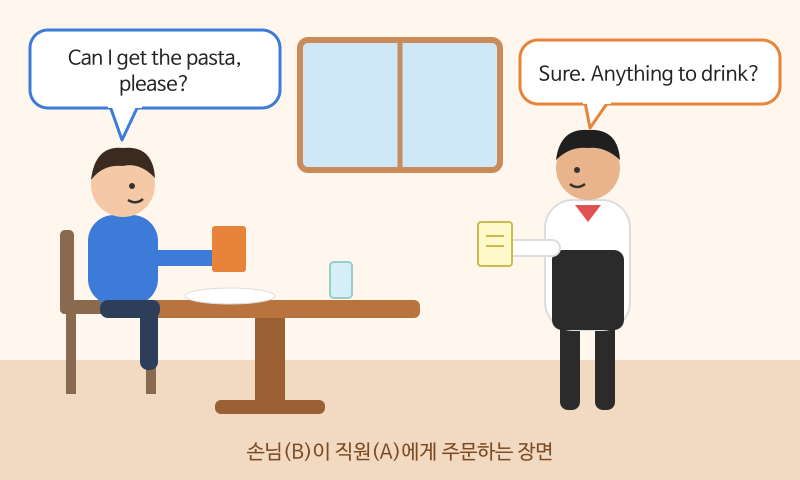

# 식당에서 주문하기

> 난이도: 초급 · 상황: 해외 여행, 출장 중 식당

## 이번 강의에서 배울 것

- 자리 안내부터 계산까지 식당에서 쓰는 기본 표현
- 공손하게 주문하는 말투: Can I ...? / I'd like ...
- 알레르기, 추천 요청 같은 자주 필요한 질문

## 핵심 설명

식당 대화는 대부분 **입장 → 주문 → 식사 중 요청 → 계산**의 순서로 흘러갑니다. 각 단계에서 쓰는 표현 몇 개만 알아도 충분히 대화할 수 있습니다.

### 대화문 듣기

A는 직원, B는 손님입니다. 목소리가 다르니 누가 말하는지 들으면서 따라 해 보세요.

- **A:** Hi, welcome! How many people? [🔊](audio/02-restaurant-01.mp3)
- **B:** Just two, please. [🔊](audio/02-restaurant-02.mp3)
- **A:** Right this way. Here are your menus. [🔊](audio/02-restaurant-03.mp3)
- **B:** Thanks. What do you recommend? [🔊](audio/02-restaurant-04.mp3)
- **A:** Our seafood pasta is very popular. [🔊](audio/02-restaurant-05.mp3)
- **B:** Sounds good. Can I get the seafood pasta, please? [🔊](audio/02-restaurant-06.mp3)
- **A:** Sure. Anything to drink? [🔊](audio/02-restaurant-07.mp3)
- **B:** I'd like a sparkling water. Oh, and I'm allergic to nuts. [🔊](audio/02-restaurant-08.mp3)
- **A:** No problem. I'll let the kitchen know. [🔊](audio/02-restaurant-09.mp3)

| 대화 | 뜻 |
|---|---|
| How many people? | 몇 분이세요? |
| Just two, please. | 두 명이요. |
| Right this way. | 이쪽으로 오세요. |
| What do you recommend? | 뭘 추천하세요? |
| Can I get ..., please? | ~ 주시겠어요? |
| Anything to drink? | 음료는 뭘로 하시겠어요? |
| I'm allergic to nuts. | 저는 견과류 알레르기가 있어요. |
| I'll let the kitchen know. | 주방에 말해 둘게요. |

### 단계별 핵심 표현

| 영어 | 한국어 | 듣기 |
|---|---|---|
| Do you have a table for two? | 두 명 자리 있나요? | [🔊](audio/02-restaurant-10.mp3) |
| Could we have a few more minutes? | 조금만 더 보고 주문할게요. | [🔊](audio/02-restaurant-11.mp3) |
| Could I have some more water? | 물 좀 더 주시겠어요? | [🔊](audio/02-restaurant-12.mp3) |
| Can we get the check, please? | 계산서 주시겠어요? | [🔊](audio/02-restaurant-13.mp3) |
| Can I pay by card? | 카드로 계산할 수 있나요? | [🔊](audio/02-restaurant-14.mp3) |

> 💡 미국 식당에서는 테이블에서 계산하는 경우가 많습니다. 계산대로 가기보다 직원에게 "Can we get the check?"라고 말하세요. 팁은 보통 음식값의 15~20%입니다.

## 자주 하는 실수

- ❌ Give me a coffee. → ✅ Can I get a coffee, please?
  - 명령문으로 주문하면 무례하게 들립니다. Can I get ... / I'd like ... 를 쓰세요.
- ❌ Bill, please! (손을 들고 크게) → ✅ Excuse me, can we get the check?
  - 먼저 Excuse me로 주의를 끈 다음 요청하는 것이 자연스럽습니다. 미국에서는 bill보다 check를 더 많이 씁니다.
- ❌ I am allergy. → ✅ I'm allergic to ...
  - allergy는 명사, allergic은 형용사입니다.

## 연습 문제

상황에 맞는 말을 영어로 해 보세요.

1. 세 명 자리가 있는지 묻기
2. 직원에게 메뉴 추천 부탁하기
3. 스테이크를 공손하게 주문하기
4. 새우 알레르기가 있다고 말하기
5. 카드로 계산해도 되는지 묻기

## 정답과 해설

1. **Do you have a table for three?**
2. **What do you recommend?** 또는 **What's good here?**
3. **Can I get the steak, please?** 또는 **I'd like the steak, please.**
4. **I'm allergic to shrimp.**
5. **Can I pay by card?**

## 오늘의 단어

| 단어 | 뜻 | 예문 | 듣기 |
|---|---|---|---|
| recommend | 추천하다 | What do you recommend? | [🔊](audio/02-restaurant-w01.mp3) |
| allergic | 알레르기가 있는 | I'm allergic to peanuts. | [🔊](audio/02-restaurant-w02.mp3) |
| check | 계산서 (미국) | Can we get the check? | [🔊](audio/02-restaurant-w03.mp3) |
| sparkling water | 탄산수 | I'd like a sparkling water. | [🔊](audio/02-restaurant-w04.mp3) |
| tip | 팁, 봉사료 | Is the tip included? | [🔊](audio/02-restaurant-w05.mp3) |
