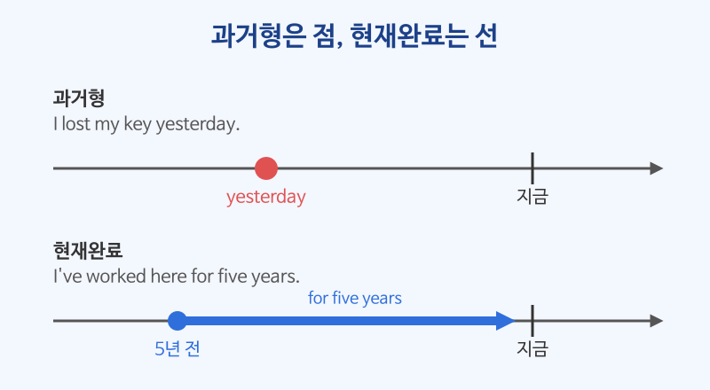

# 현재완료 (have + 과거분사)

## 이번 강의에서 배울 것

- 현재완료가 "과거의 일이 지금과 연결되어 있음"을 나타낸다는 것
- 현재완료의 네 가지 쓰임: 경험, 계속, 완료, 결과
- 과거형과 현재완료를 구별하는 기준

## 핵심 설명

현재완료는 **have/has + 과거분사(p.p.)** 로 만듭니다. 과거형이 "과거의 한 시점"만 말한다면, 현재완료는 **과거부터 지금까지 이어지는 선**을 말합니다.

| 형태 | 예 |
|---|---|
| I / You / We / They + have p.p. | I have finished. (I've finished.) |
| He / She / It + has p.p. | She has left. (She's left.) |
| 부정문 | I haven't seen it. |
| 의문문 | Have you ever been to Japan? |

### 1) 경험: ~해 본 적이 있다

| 영어 | 한국어 | 듣기 |
|---|---|---|
| I've been to London twice. | 나는 런던에 두 번 가 봤다. | [🔊](audio/01-present-perfect-01.mp3) |
| Have you ever tried Thai food? | 태국 음식 먹어 본 적 있어요? | [🔊](audio/01-present-perfect-02.mp3) |

### 2) 계속: (지금까지) 계속 ~해 왔다

| 영어 | 한국어 | 듣기 |
|---|---|---|
| I've worked here for five years. | 나는 여기서 5년째 일하고 있다. | [🔊](audio/01-present-perfect-03.mp3) |
| She has lived in Seoul since 2019. | 그녀는 2019년부터 서울에 살고 있다. | [🔊](audio/01-present-perfect-04.mp3) |

### 3) 완료: 막 ~했다

| 영어 | 한국어 | 듣기 |
|---|---|---|
| I've just sent the email. | 방금 이메일을 보냈어요. | [🔊](audio/01-present-perfect-05.mp3) |
| Have you finished the report yet? | 보고서 벌써 끝냈어요? | [🔊](audio/01-present-perfect-06.mp3) |

### 4) 결과: ~해서 (지금) ~한 상태다

| 영어 | 한국어 | 듣기 |
|---|---|---|
| I've lost my key. | 열쇠를 잃어버렸다. (그래서 지금 없다) | [🔊](audio/01-present-perfect-07.mp3) |
| He has gone home. | 그는 집에 갔다. (그래서 지금 여기 없다) | [🔊](audio/01-present-perfect-08.mp3) |

### 과거형과 현재완료 구별하기

| 과거형 | 현재완료 |
|---|---|
| 끝난 과거 시점을 말함 | 지금과 연결된 과거를 말함 |
| yesterday, last week, in 2020, ago와 함께 | for, since, ever, never, just, yet, already와 함께 |
| I **lost** my key yesterday. | I'**ve lost** my key. |

> 💡 "언제?"가 분명하면 과거형, "지금 어떤가?"가 중요하면 현재완료입니다.

## 자주 하는 실수

- ❌ I have seen him yesterday. → ✅ I saw him yesterday.
  - yesterday처럼 끝난 시점을 말하는 표현은 현재완료와 함께 쓰지 않습니다.
- ❌ I live here since 2020. → ✅ I've lived here since 2020.
  - "~부터 지금까지"는 현재형이 아니라 현재완료로 말합니다.
- ❌ She has went out. → ✅ She has gone out.
  - have/has 뒤에는 과거형(went)이 아니라 과거분사(gone)를 씁니다.

## 연습 문제

괄호 안의 동사를 현재완료 또는 과거형으로 바꾸세요.

1. I ___ (know) him for ten years.
2. We ___ (meet) the client last Monday.
3. ___ you ever ___ (be) to Jeju?
4. She ___ (already, leave) the office.
5. They ___ (move) to Daejeon in 2021.

## 정답과 해설

1. **have known**: for ten years는 "지금까지 10년 동안"이므로 계속 용법.
2. **met**: last Monday는 끝난 과거 시점이므로 과거형.
3. **Have / been**: ever와 함께 경험을 묻는 현재완료.
4. **has already left**: already는 완료 용법과 잘 어울립니다.
5. **moved**: in 2021은 끝난 과거 시점이므로 과거형.

## 오늘의 단어

| 단어 | 뜻 | 예문 | 듣기 |
|---|---|---|---|
| client | 고객, 거래처 | We've met the client. | [🔊](audio/01-present-perfect-w01.mp3) |
| report | 보고서 | I've finished the report. | [🔊](audio/01-present-perfect-w02.mp3) |
| already | 이미, 벌써 | She has already left. | [🔊](audio/01-present-perfect-w03.mp3) |
| yet | (부정·의문) 아직, 벌써 | Has he called yet? | [🔊](audio/01-present-perfect-w04.mp3) |
| since | ~이래로 | I've been here since noon. | [🔊](audio/01-present-perfect-w05.mp3) |
